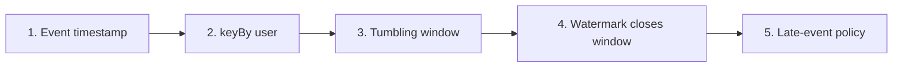
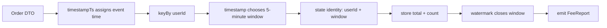
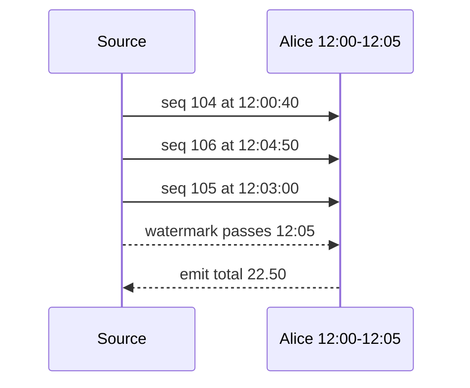
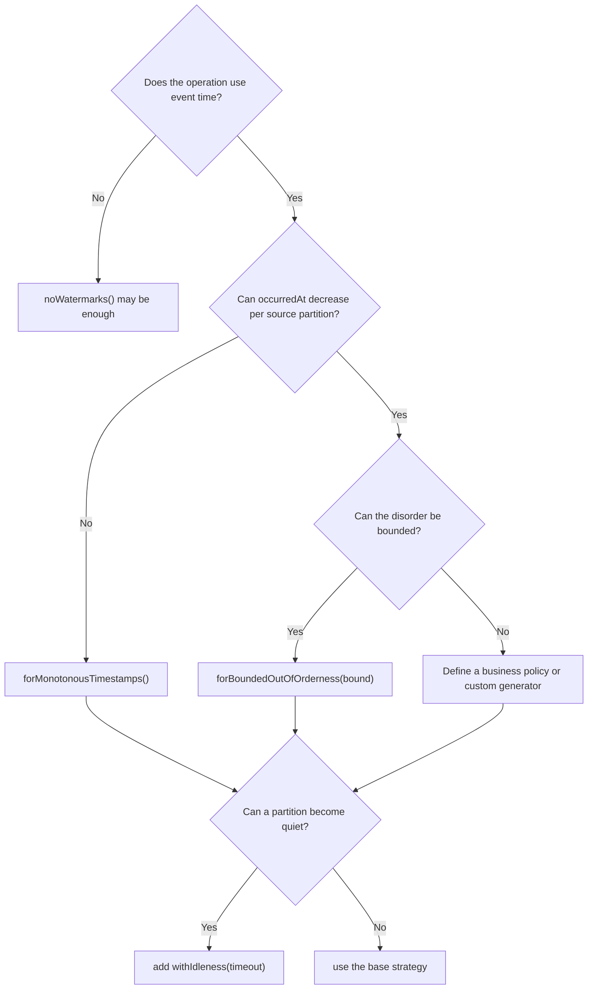

# Event Time Fundamentals

This lab deliberately has no Kafka, database, or deployment configuration. Its only question is:

> How does Flink turn out-of-order order events into one fee total per user per five-minute business-time period?

Keep [Flink Streaming Glossary](glossary.md) open while reading. It follows the official Flink vocabulary and adds billing and DevOps interpretations for each term.

Learn the concepts in this order:



## Source code map

The example is not only documentation. Its complete source is under `modules/flink/event-time-lab`:

| File | What to learn from it |
| --- | --- |
| [`EventTimeLabJob.java`](https://github.com/azusachino/flos/blob/main/modules/flink/event-time-lab/src/main/java/io/github/azusachino/flos/flink/eventtime/EventTimeLabJob.java) | Assembles the source, timestamps, watermark strategy, `keyBy`, window, aggregate, and output |
| [`OrderEvent.java`](https://github.com/azusachino/flos/blob/main/modules/flink/event-time/src/main/java/io/github/azusachino/flos/flink/eventtime/OrderEvent.java) | Separates source sequence, fee, and event timestamp |
| [`FeeAggregate.java`](https://github.com/azusachino/flos/blob/main/modules/flink/event-time/src/main/java/io/github/azusachino/flos/flink/eventtime/FeeAggregate.java) | Maintains a small incremental total per user and window |
| [`FeeWindow.java`](https://github.com/azusachino/flos/blob/main/modules/flink/event-time/src/main/java/io/github/azusachino/flos/flink/eventtime/FeeWindow.java) | Adds the user and window boundaries to the final report |
| [`EventTimeConceptsTest.java`](https://github.com/azusachino/flos/blob/main/modules/flink/event-time-lab/src/test/java/io/github/azusachino/flos/flink/eventtime/EventTimeConceptsTest.java) | Verifies exact window boundaries, out-of-order aggregation, and watermark calculation |

The complete transformation is short:

```java
var watermarks =
        WatermarkStrategy.<OrderEvent>forBoundedOutOfOrderness(
                        Duration.ofSeconds(30))
                .withTimestampAssigner(
                        (event, previousTimestamp) ->
                                event.occurredAt().toEpochMilli());

environment
        .fromData(events)
        .assignTimestampsAndWatermarks(watermarks)
        .keyBy(OrderEvent::customerId)
        .window(TumblingEventTimeWindows.of(Duration.ofMinutes(5)))
        .aggregate(new FeeAggregate(), new FeeWindow())
        .print();
```

Each following section explains one line of that transformation.

## Three notions of time

An order event carries `occurredAt`, such as `12:03:00`. That is **event time**: when the business event happened.

**Processing time** is when Flink happens to handle the record. An event that happened at `12:03` might reach Flink at `12:04`.

A **watermark** is neither of those clocks. It is Flink's estimate of progress through event time.

```text
occurredAt       12:03:00   business fact inside the event
processing time  12:04:02   when this machine handles it
watermark        12:03:40   earlier event times are now considered late
```

### Time comparison

| Time concept | Comes from | Answers | Behavior after replay |
| --- | --- | --- | --- |
| Event time | `event.occurredAt()` | When did the business event happen? | The event returns to the same window |
| Processing time | Flink worker clock | When is Flink handling it? | A replay may enter a different processing-time window |
| Watermark | Strategy derived from observed event timestamps | How complete does Flink consider event time? | Recomputed as the replayed source progresses |

For historical billing, event time is normally the correct choice because retrying the job should not move an order into a different report.

## Step 1: assign event timestamps

The lab tells Flink to use `occurredAt`:

```java
var watermarks =
        WatermarkStrategy.<OrderEvent>forBoundedOutOfOrderness(
                        Duration.ofSeconds(30))
                .withTimestampAssigner(
                        (event, previousTimestamp) ->
                                event.occurredAt().toEpochMilli());
```

The timestamp assigner answers “when did this order happen?” The watermark generator separately answers “how far through event time have we progressed?”

If the application DTO exposes an epoch-millisecond field named `timestampTs`, the equivalent assignment is:

```java
.withTimestampAssigner(
        (dto, previousTimestamp) -> dto.timestampTs())
```

This does not make `timestampTs` a key. It attaches the DTO's business timestamp to the Flink record. Confirm the unit at the source boundary: epoch seconds and epoch milliseconds are not interchangeable.

## Step 2: group by user

```java
.keyBy(OrderEvent::customerId)
```

`keyBy` ensures every Alice event reaches the same logical keyed operator. It does not create a time period and it does not preserve one global input order.

Flink can now maintain independent state:

```text
alice -> her open windows
bob   -> his open windows
```

Do not use the timestamp as the key:

```java
// Correct for one fee report per user.
.keyBy(OrderDto::userId)

// Incorrect: this groups records that happen at the exact same timestamp.
.keyBy(OrderDto::timestampTs)
```

Keep three independent coordinates separate:

| Coordinate | Example | Purpose |
| --- | --- | --- |
| Kafka record key | `alice` | Chooses the Kafka partition once Kafka is introduced |
| Flink `keyBy` value | `alice` | Chooses the keyed Flink state and operator instance |
| Event timestamp | `12:03:00` | Chooses the event-time window |

Using `userId` for both the Kafka record key and Flink `keyBy` is common, but they remain separate partitioning operations.

## Step 3: assign a tumbling window

```java
.window(TumblingEventTimeWindows.of(Duration.ofMinutes(5)))
```

Tumbling windows are fixed, adjacent, and non-overlapping:

```text
[12:00, 12:05) [12:05, 12:10) [12:10, 12:15)
```

Each event belongs to exactly one window:

```text
12:04:59.999 -> [12:00, 12:05)
12:05:00.000 -> [12:05, 12:10)
```

The repository test calls Flink's real `TumblingEventTimeWindows` assigner and verifies this boundary.

After `keyBy` and `window`, the effective state identity is approximately:

```text
(userId, window)
```

For the example input, Flink maintains independent state entries:

```text
("alice", [12:00, 12:05)) -> total=22.50, count=3
("bob",   [12:00, 12:05)) -> total=4.00,  count=1
("alice", [12:05, 12:10)) -> total=3.00,  count=1
```

`userId` chooses the first coordinate. `timestampTs` or `occurredAt` chooses the second coordinate by placing the event on the timeline.

### Window comparison

| Window | Shape | Example use | Does one event enter multiple windows? |
| --- | --- | --- | --- |
| Tumbling | Fixed and non-overlapping | One final fee report for each five-minute period | No |
| Sliding | Fixed and overlapping | Recalculate the previous five minutes every minute | Usually yes |
| Session | Variable gap between bursts | One user-shopping session ending after inactivity | No, but sessions can merge |
| Global | One logical window | Custom trigger and eviction behavior | Depends on custom logic |

The requested billing report uses tumbling windows because `[12:00,12:05)` and `[12:05,12:10)` must not count the same order twice.

## Step 4: aggregate while the window is open

The lab receives Alice's records in this arrival order:

```text
arrival   sequence   occurredAt   fee
1         104        12:00:40     10.00
2         106        12:04:50      5.00
3         105        12:03:00      7.50
```

Sequence 105 arrives after 106, but all three timestamps belong to the same window:

```text
alice + [12:00, 12:05) = 10.00 + 5.00 + 7.50 = 22.50
```

The aggregate stores only a running total and count:

```java
public FeeAccumulator add(OrderEvent event, FeeAccumulator accumulator) {
    return new FeeAccumulator(
            accumulator.totalFee().add(event.fee()),
            accumulator.eventCount() + 1);
}
```

### Does Flink store five minutes of raw events?

Not with this `AggregateFunction`. It stores one small `FeeAccumulator` for each open `(userId, window)`:

```text
initial state  total=0.00,  count=0
after 10.00    total=10.00, count=1
after 5.00     total=15.00, count=2
after 7.50     total=22.50, count=3
```

The state is approximately:

```java
FeeAccumulator(totalFee = 22.50, eventCount = 3)
```

It is not a five-minute list containing all three complete `OrderEvent` objects. Incremental aggregation keeps state proportional to the number of open user/window combinations rather than the raw event count.

This differs from using only a full-window `ProcessWindowFunction`, which may require retaining the window's elements until evaluation. The lab combines an incremental `FeeAggregate` with `FeeWindow`: the aggregate maintains compact state, and the window function adds `customerId`, `windowStart`, and `windowEnd` when emitting the report.



## Step 5: close the window with a watermark

The job allows 30 seconds of timestamp disorder. Conceptually:

```text
watermark ≈ greatest observed event timestamp - 30 seconds
```

After observing `12:04:50`, the watermark can approach `12:04:20`. The event at `12:03:00` is now behind the watermark and would be late if it had not already been processed before that watermark was emitted.

After observing `12:05:31`, the watermark can pass `12:05`. Flink may then emit the `12:00–12:05` window.



Watermarks are emitted periodically. The configured 30 seconds is therefore a completeness policy, not an exact output timer.

### Watermark strategy comparison

| Strategy | Assumption | Output delay | Fit for the order example |
| --- | --- | --- | --- |
| `noWatermarks()` | No event-time progress is required | None from watermarks | Wrong: the unbounded event-time windows would not close normally |
| `forMonotonousTimestamps()` | Event timestamps never decrease within a source partition | Mainly the periodic emission interval | Wrong if sequence 106 can have an older `occurredAt` than 105 |
| `forBoundedOutOfOrderness(30s)` | No future timestamp will be more than 30 seconds behind the maximum observed timestamp | Approximately 30 seconds plus periodic emission | The lab's explicit learning assumption |
| `forGenerator(custom)` | Progress follows a domain-specific rule | Defined by that rule | Useful if the upstream system sends a reliable period-complete marker |

The monotonic event `sequence` and a monotonic timestamp are not equivalent:

```text
sequence 105 -> occurredAt 12:04:50
sequence 106 -> occurredAt 12:03:00
```

The sequence moved forward while event time moved backward. Therefore, `forMonotonousTimestamps()` would be unsafe even though sequence numbers always increase.

`withIdleness(Duration.ofMinutes(1))` is not a fifth base strategy. It decorates one of the strategies above and temporarily excludes a quiet input from downstream watermark calculation.

Choose a strategy by asking:



## Multiple source partitions

With several active inputs, downstream event-time progress follows the slowest watermark:

```text
partition 0 watermark = 12:05:10
partition 1 watermark = 12:04:20
effective watermark   = 12:04:20
```

The first window stays open because partition 1 might still provide an event before `12:05`.

For a sparse source, `withIdleness(timeout)` marks a quiet partition idle so it temporarily stops holding back the minimum. Idleness does not advance time by itself; if every input stops, no new event timestamp advances the watermark.

The current lab does not create real Kafka partitions. `sourcePartition` is an illustrative field inside `OrderEvent`, while:

```java
environment.setParallelism(1);
```

runs one Flink subtask over one bounded in-memory source. The lab teaches timestamp, key, window, accumulator, and watermark semantics. Actual 16-partition watermark merging belongs to the later Kafka integration exercise.

## Late events are a business decision

An event is late when it belongs to a window whose end has already been passed by the watermark.

Possible policies include:

- drop it;
- retain the window with allowed lateness and emit a correction;
- send it to a side output for reconciliation;
- wait for an explicit upstream completeness signal.

Billing should not silently choose one. This lab first teaches the boundary; [Late Data Correction and Reconciliation](late-data-reconciliation.md) implements the correction and side-output policies against the Kafka pipeline.

## Run the lab

```sh
make flink-event-time
```

Expected totals include:

```text
alice [12:00, 12:05) total=22.50 count=3
alice [12:05, 12:10) total=3.00 count=1
bob   [12:00, 12:05) total=4.00 count=1
```

Because the source is bounded, Flink emits a final maximum watermark when the input ends. That closes every remaining window. A Kafka source is unbounded and therefore depends continuously on its configured watermark policy.

### Bounded versus Kafka comparison

| Property | This concept lab | Later Kafka job |
| --- | --- | --- |
| Input | Five in-memory records | Unbounded external topic |
| End of input | Yes | Normally never |
| Final maximum watermark | Emitted automatically | Not available during normal operation |
| Infrastructure | None | Kafka and connector configuration |
| Learning purpose | Observe deterministic window results | Apply the concepts under real partition behavior |

## Exercises

1. Change Alice sequence 105 to `occurredAt=12:05:00` and predict its window before running the test.
2. Change the window size to ten minutes and write down the new boundaries.
3. Change the disorder bound to ten seconds and explain which arrival patterns become late.
4. Add a third user and verify that `keyBy` keeps the totals independent.
