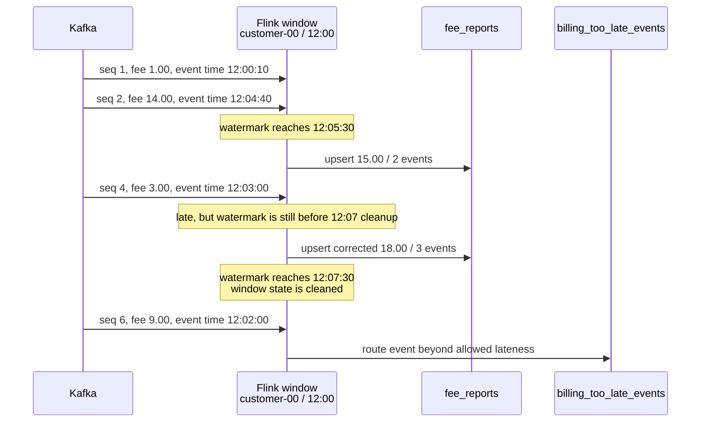

# Late Data Correction and Reconciliation

A watermark crossing a window end does not have to mean “the report can never change.” Flink separates two boundaries:

1. the **first firing boundary**, when the watermark reaches the window end
2. the **cleanup boundary**, when the watermark reaches the window end plus allowed lateness

The billing pipeline keeps `[12:00, 12:05)` correctable for two more minutes:

```java
orders
        .keyBy(OrderEvent::customerId)
        .window(TumblingEventTimeWindows.of(Duration.ofMinutes(5)))
        .allowedLateness(Duration.ofMinutes(2))
        .sideOutputLateData(TOO_LATE_EVENTS)
        .aggregate(new FeeAggregate(), new FeeWindow());
```

This is not five minutes of temporary event storage followed by a batch query. It is continuously updated keyed window state. The aggregate stores the compact fee total and count for each `(customerId, window)` until Flink cleans that state.

## The three clocks

Keep these values separate:

| Value | Example | Decides |
| --- | --- | --- |
| event timestamp | `dto.timestampTs = 12:03` | which window owns the event |
| watermark | `12:05:30` | whether that window has fired |
| processing time | event arrived at the job at `12:06:20` wall time | when Flink happened to process it |

`dto.timestampTs` is assigned as event time; it is not a `keyBy` key:

```java
.withTimestampAssigner(
        (event, previousTimestamp) ->
                event.occurredAt().toEpochMilli())

.keyBy(OrderEvent::customerId)
```

The timestamp selects `[12:00, 12:05)`. The customer key decides which keyed aggregate owns the event. Kafka partition and offset remain source-placement and recovery coordinates.

## Exact lifecycle of one window

For this job:

```text
window                          [12:00, 12:05)
first firing                    watermark >= 12:05
allowed lateness                2 minutes
state cleanup / final boundary  watermark >= 12:07
```



### Stage 1: on-time report

All 16 Kafka partitions publish an event at `12:06`. With 30 seconds of bounded disorder, the downstream watermark reaches approximately `12:05:30`. The first window fires:

```text
16 reports
150.00 total fee
17 accepted events
```

The window state is **not** deleted yet because the cleanup boundary is `12:07`.

### Stage 2: accepted late correction

Partition 0 next publishes sequence 4:

```json
{
    "customerId": "customer-00",
    "sequence": 4,
    "fee": "3.00",
    "occurredAt": "2026-07-30T12:03:00Z"
}
```

Its timestamp is behind the `12:05:30` watermark, so it is late. It is still within the two-minute retention interval. Flink adds it to the retained accumulator and fires an updated complete aggregate:

```text
customer-00: 15.00 / 2 events -> 18.00 / 3 events
all reports: 150.00 / 17 events -> 153.00 / 18 events
```

The JDBC sink upserts by `(customer_id, window_start, window_end)`. It replaces the prior complete value instead of appending another invoice:

```sql
ON DUPLICATE KEY UPDATE
    total_fee = VALUES(total_fee),
    event_count = VALUES(event_count)
```

Allowed lateness therefore requires a correction-compatible sink. An append-only sink would contain both the provisional and corrected reports unless it carries a revision/retraction contract.

### Stage 3: cleanup

The fixture publishes `12:08` events to all partitions. The watermark advances to approximately `12:07:30`, beyond:

```text
window end 12:05 + allowed lateness 00:02 = cleanup at 12:07
```

Flink clears the keyed state for the first window. Allowed lateness is state retention, so increasing it increases concurrent state, checkpoint size, and the time during which reports remain provisional.

### Stage 4: event beyond allowed lateness

Partition 0 publishes sequence 6 with event time `12:02`. The first-window state no longer exists. `sideOutputLateData` routes the original event to `billing_too_late_events`; it does not modify `fee_reports`.

The side output is an explicit operational queue:

```java
reports.getSideOutput(TOO_LATE_EVENTS)
        .sinkTo(eventSink(settings, TOO_LATE_UPSERT_SQL));
```

In a real billing system, its owner may repair producer timestamps, approve a ledger adjustment, replay into a correction job, or reject the event. The policy must not be “a metric increased, so data is somebody else's problem.”

## Why an audit sink exists

The pipeline idempotently records every deserialized Kafka event in `billing_event_audit`:

```sql
PRIMARY KEY (source_partition, sequence_number)
```

This identity uses the producer's monotonic sequence within its physical partition. It makes replayed at-least-once writes safe and exposes sequence gaps. It is not used for window assignment.

The three sink views have different meanings:

| Table                     | Meaning                                          |
| ------------------------- | ------------------------------------------------ |
| `billing_event_audit`     | all events Flink consumed                        |
| `fee_reports`             | accepted events represented in window aggregates |
| `billing_too_late_events` | consumed events excluded after cleanup           |

## Reconciliation equation

For one window, the acceptance test checks both money and count:

```text
audited source events - explicitly too-late events = reported accepted events

162.00 - 9.00 = 153.00
19 - 1 = 18
```

Equivalently:

```text
fee delta   = audit fee - too-late fee - report fee = 0.00
count delta = audit count - too-late count - report count = 0
```

The SQL uses independent subqueries so joining event rows to report rows cannot multiply amounts:

```sql
SELECT
    audit_fee - too_late_fee - report_fee AS fee_delta,
    audit_count - too_late_count - report_count AS count_delta;
```

A zero delta proves this controlled fixture balances. It does not prove that an arbitrary producer emitted every intended business event; Kafka and Flink cannot reconcile an event that never reached the source.

## DevOps policy decisions

Before enabling allowed lateness, record:

- measured arrival-disorder distribution by producer and partition
- first-report SLO
- correction horizon and finality promise
- expected correction volume
- maximum retained state and checkpoint impact
- sink upsert/revision contract
- too-late queue owner and response SLO
- reconciliation frequency, dimensions, and tolerance

Do not choose a larger value only to make `numLateRecordsDropped` become zero. That trades visible rejection for later finality and more state.

## Incident workflow

When reconciliation is non-zero:

1. freeze deletion or compaction of the source and audit evidence
2. scope the delta by window, customer, source partition, and sequence
3. compare Kafka offsets and per-partition sequence gaps
4. inspect watermark progress, idleness transitions, restarts, and sink errors
5. classify records as accepted, corrected, too late, duplicate, malformed, or missing
6. repair through the authoritative ledger/correction process
7. rerun both fee and count reconciliation
8. record the affected windows and approval

Never fix a money delta by directly changing only the aggregate row without preserving an auditable adjustment.

## Run the evidence

```sh
make flink-up
make flink-billing-smoke
make flink-down
```

Successful output:

```text
billing smoke: 16 partitions, corrected report 153.00 / 18 events,
one 9.00 too-late event, reconciliation delta 0.00 / 0 events
```

The verifier waits for each stage before publishing the next one, so the accepted correction is known to arrive after the first report, and the rejected event is known to arrive after the cleanup watermark.

## Official references

- [Windows and allowed lateness](https://nightlies.apache.org/flink/flink-docs-release-2.2/docs/dev/datastream/operators/windows/)
- [Event-time watermarks](https://nightlies.apache.org/flink/flink-docs-release-2.2/docs/dev/datastream/event-time/generating_watermarks/)
- [Side outputs](https://nightlies.apache.org/flink/flink-docs-release-2.2/docs/dev/datastream/operators/side_output/)
