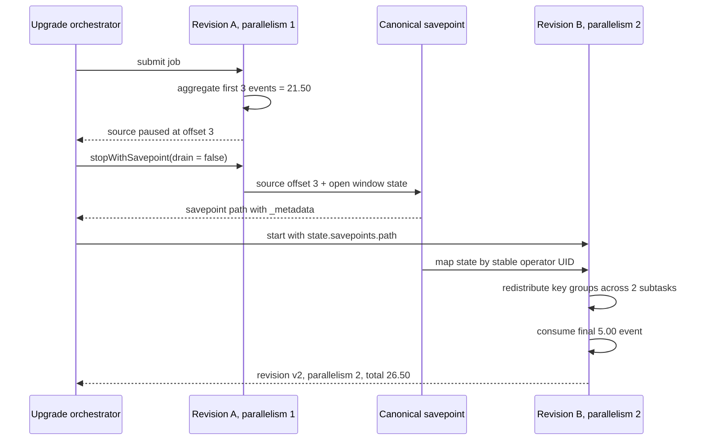

# Savepoint Upgrade and Rescaling Lab

Checkpoint recovery and savepoint upgrades preserve the same kinds of state, but solve different operational problems:

```text
checkpoint -> Flink automatically recovers an unexpectedly failed job
savepoint  -> an operator deliberately moves state across a planned change
```

This lab starts billing revision A at parallelism 1, pauses with Alice's five-minute window still open, stops with a canonical savepoint, and restores revision B at parallelism 2.

Run it:

```sh
make flink-savepoint-upgrade
```

## Proven workflow



The source is paused before the savepoint so the snapshot contains a useful intermediate state:

| State               | Revision A savepoint     |
| ------------------- | ------------------------ |
| Source cursor       | next event index `3`     |
| Alice window        | total `21.50`, count `3` |
| Window interval     | `[12:00, 12:05)`         |
| Window parallelism  | `1`                      |
| Maximum parallelism | `16`                     |

Revision B restores those values, consumes the final `5.00` event, and closes the window at end of input.

## Revision A: establish the change boundary

The test starts revision A asynchronously because the client must remain available to request the savepoint:

```java
var revisionA = SavepointUpgradeLab.createEnvironment(1, null);
SavepointUpgradeLab.buildRevision(revisionA, true, "v1").print();
var revisionAClient = revisionA.executeAsync("billing-revision-a");
```

The teaching source emits three events and then releases a probe while remaining alive. A real Kafka source remains alive naturally because its topic is unbounded.

```java
if (pause && nextEventIndex == pauseAfterEvents) {
    paused.countDown();
    while (running) {
        Thread.sleep(5);
    }
}
```

The test requests a stop-with-savepoint without draining event time:

```java
String savepointPath =
        revisionAClient
                .stopWithSavepoint(
                        false,
                        savepointDirectory.toUri().toString(),
                        SavepointFormatType.CANONICAL)
                .get(20, TimeUnit.SECONDS);
```

`drain = false` matters for an open window. Draining advances event time toward its end before stopping and may fire event-time timers. This experiment intentionally preserves the 12:00–12:05 window as open state for revision B.

The test verifies that the returned savepoint is materialized:

```java
assertThat(Path.of(URI.create(savepointPath)).resolve("_metadata")).exists();
```

The `_metadata` file is the savepoint entry point. The surrounding directory also contains or references state data and must be managed as a unit.

## Stable stateful operator identity

Both revisions use exactly the same UIDs for state-bearing parts of the topology:

```java
static final String SOURCE_UID = "billing-order-source-v1";
static final String EVENT_TIME_UID = "billing-event-time-v1";
static final String WINDOW_UID = "billing-five-minute-fee-v1";
```

The topology applies them explicitly:

```java
source.uid(SOURCE_UID)
        .assignTimestampsAndWatermarks(watermarks)
        .uid(EVENT_TIME_UID)
        .keyBy(OrderEvent::customerId)
        .window(TumblingEventTimeWindows.of(Duration.ofMinutes(5)))
        .aggregate(new FeeAggregate(), new FeeWindow())
        .uid(WINDOW_UID);
```

A generated operator ID depends on topology structure and can change after apparently harmless edits. An explicit UID makes state mapping an application-owned compatibility contract.

The `keyBy` transformation itself has no independent operator state. Its key selector determines how records and keyed state are partitioned into the downstream window operator.

## Revision B: restore and rescale

Revision B receives the savepoint path through Flink configuration:

```java
var configuration = new Configuration();
configuration.set(StateRecoveryOptions.SAVEPOINT_PATH, savepointPath);

var environment =
        StreamExecutionEnvironment.getExecutionEnvironment(configuration);
environment.setParallelism(2);
environment.setMaxParallelism(16);
```

Maximum parallelism remains `16`. That keeps the key-group space stable while the runtime parallelism changes:

```text
revision A: 16 key groups distributed over 1 window subtask
revision B: 16 key groups redistributed over 2 window subtasks
```

Alice remains one key and therefore belongs to exactly one revision B subtask. Rescaling redistributes key groups; it does not split one hot key across subtasks.

## Compatible code change

Revision B identifies its output through a new stateless operator:

```java
.map(new RevisionMarker("v2"))
.uid("billing-report-revision-v2");
```

Adding a stateless operator after the restored stateful window is compatible because the savepoint has no old state to map into that new operator. Moving, removing, or changing the serializer of a stateful operator requires a separate compatibility decision.

The marker reads actual runtime task information:

```java
var task = getRuntimeContext().getTaskInfo();
return new UpgradeResult(
        report,
        revision,
        task.getIndexOfThisSubtask(),
        task.getNumberOfParallelSubtasks());
```

## Acceptance evidence

The integration assertion requires all of the important results:

```java
assertThat(result.revision()).isEqualTo("v2");
assertThat(result.windowParallelism()).isEqualTo(2);
assertThat(result.windowSubtask()).isBetween(0, 1);
assertThat(result.report().totalFee()).isEqualByComparingTo("26.50");
assertThat(result.report().eventCount()).isEqualTo(4);
```

This proves:

- revision A ran and reached source offset 3
- a canonical stop-with-savepoint completed
- the savepoint contains readable metadata
- revision B restored using stable UIDs
- the window operator ran at parallelism 2
- Alice's open window state survived redistribution
- the source resumed from its saved cursor
- the final business result remained unchanged

## Compatibility matrix

| Proposed revision B change | Default expectation | Required evidence |
| --- | --- | --- |
| Add stateless operator | Compatible | Restore test |
| Rename display label | Compatible when UID is unchanged | Restore test |
| Change runtime parallelism within max parallelism | Compatible | Restore and skew test |
| Change max parallelism | Potentially incompatible | Dedicated migration test |
| Change a stateful UID | Incompatible by default | Explicit remapping or authorized state loss |
| Change `keyBy` logic | New keyed-state meaning | Data migration and reconciliation |
| Change window size or offset | Existing timers/state no longer mean the same thing | Versioned topology or controlled state reset |
| Change accumulator/serializer | Depends on serializer compatibility | Old-artifact savepoint restored by new artifact |
| Remove stateful operator | Unmapped state remains | Explicit disposal decision; avoid casual `allowNonRestoredState` |

## Operational translation

The local test performs the same logical steps as a production rollout:

```text
local test                         production
temporary directory               durable object storage
executeAsync                      deployed running job
pause probe                       confirmed source/window progress
stopWithSavepoint API             CLI or Kubernetes Operator savepoint upgrade
StateRecoveryOptions path         initialSavepointPath / restore configuration
parallelism 1 -> 2                capacity or skew-driven rescale
assert FeeReport                  reconcile sink and business totals
```

Production adds source ownership, durable storage, sink transactions, traffic coordination, deployment health, rollback, and retention management.

## What remains unproven

This experiment does not prove:

- restore across different Flink framework versions
- serializer evolution across separately built historical artifacts
- a savepoint stored in S3 or another durable filesystem
- real Kafka partition reassignment during restore
- external sink correctness during the revision boundary
- rollback from revision B to revision A after B has committed output

The next project milestone connects the same billing state model to a real 16-partition Kafka topic.

## Source files

- [`SavepointUpgradeLab.java`](https://github.com/azusachino/flos/blob/main/modules/flink/checkpoint-recovery-lab/src/main/java/io/github/azusachino/flos/flink/recovery/SavepointUpgradeLab.java)
- [`SavepointOrderSource.java`](https://github.com/azusachino/flos/blob/main/modules/flink/checkpoint-recovery-lab/src/main/java/io/github/azusachino/flos/flink/recovery/SavepointOrderSource.java)
- [`SavepointUpgradeLabTest.java`](https://github.com/azusachino/flos/blob/main/modules/flink/checkpoint-recovery-lab/src/test/java/io/github/azusachino/flos/flink/recovery/SavepointUpgradeLabTest.java)

## Official references

- [Savepoints](https://nightlies.apache.org/flink/flink-docs-release-2.2/docs/ops/state/savepoints/)
- [Checkpoints versus savepoints](https://nightlies.apache.org/flink/flink-docs-release-2.2/docs/ops/state/checkpoints_vs_savepoints/)
- [Upgrading applications and Flink versions](https://nightlies.apache.org/flink/flink-docs-master/docs/ops/upgrading/)
