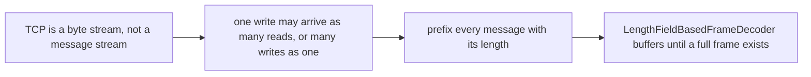
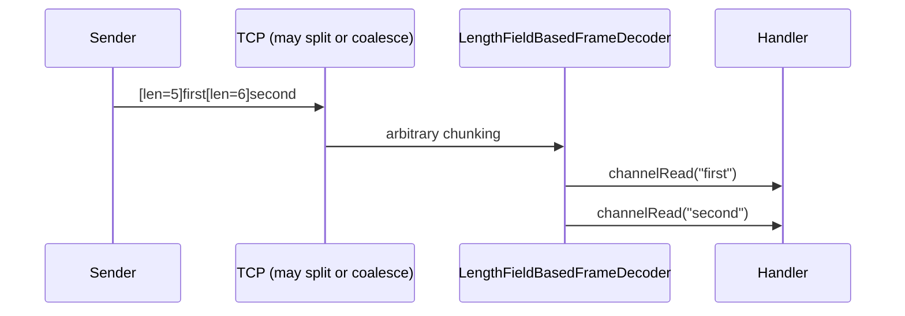

# Netty Framing and Codecs

The [event loop lab](event-loop.md) assumed each `channelRead` delivers exactly one application message. This lab proves that assumption false, then fixes it. Its only question is:

> If two messages are written back-to-back, or one message arrives in two pieces, how does the pipeline still recover exactly the original messages?



## Source code map

The example is not only documentation. Its complete source is under `modules/netty/framing-lab`:

| File | What to learn from it |
| --- | --- |
| [`FramingLabServer.java`](https://github.com/azusachino/flos/blob/main/modules/netty/framing-lab/src/main/java/io/github/azusachino/flos/netty/framing/FramingLabServer.java) | Wires `LengthFieldBasedFrameDecoder` and `LengthFieldPrepender` around a business handler |
| [`FramedEchoHandler.java`](https://github.com/azusachino/flos/blob/main/modules/netty/framing-lab/src/main/java/io/github/azusachino/flos/netty/framing/FramedEchoHandler.java) | Only ever sees complete frames — framing concerns never reach it |
| [`FramingCodecTest.java`](https://github.com/azusachino/flos/blob/main/modules/netty/framing-lab/src/test/java/io/github/azusachino/flos/netty/framing/FramingCodecTest.java) | Proves the coalescing problem, proves the decoder solves it, and proves it over a real socket |

## The problem, proven

```java
ByteBuf combined =
        Unpooled.wrappedBuffer(
                "first".getBytes(StandardCharsets.UTF_8),
                "second".getBytes(StandardCharsets.UTF_8));
channel.writeInbound(combined);

assertThat(received).hasSize(1);
assertThat(received.get(0).toString(StandardCharsets.UTF_8)).isEqualTo("firstsecond");
```

`rawPipelineCoalescesTwoMessagesIntoOneRead` feeds a plain handler two application messages that arrived as a single chunk of bytes — exactly what can happen on a real TCP connection when the kernel buffers two small writes together. The handler has no way to tell where `"first"` ends and `"second"` begins. TCP guarantees byte order, not message boundaries.

The opposite failure is just as real: a single message can arrive split across two or more reads if the sender's write is larger than a packet, or the receiver reads before all bytes have arrived.

## The fix: prefix every message with its length

```java
new LengthFieldBasedFrameDecoder(MAX_FRAME_LENGTH, 0, LENGTH_FIELD_LENGTH, 0, LENGTH_FIELD_LENGTH)
new LengthFieldPrepender(LENGTH_FIELD_LENGTH)
```

| Parameter | Value here | Meaning |
| --- | --- | --- |
| `maxFrameLength` | `1024` | Refuse to buffer forever if a length field is corrupt or hostile |
| `lengthFieldOffset` | `0` | The length field is the first thing in the frame |
| `lengthFieldLength` | `4` | A 4-byte big-endian integer holds the body length |
| `lengthAdjustment` | `0` | The length field counts only the body, not itself |
| `initialBytesToStrip` | `4` | Strip the length field so downstream handlers see only the body |

`LengthFieldPrepender` is the mirror image on the outbound side: it measures whatever `ByteBuf` a handler writes and prepends its length before the write continues toward the socket. Together they make framing symmetric — whichever side wrote a length-prefixed message, the other side's decoder buffers until that many bytes exist, and emits exactly one frame containing exactly the body.



## Buffering a message that arrives in two pieces

```java
int splitPoint = 6; // inside the 4-byte length header plus two body bytes
channel.writeInbound(Unpooled.wrappedBuffer(bytes, 0, splitPoint));
assertThat(received).isEmpty();

channel.writeInbound(Unpooled.wrappedBuffer(bytes, splitPoint, bytes.length - splitPoint));
assertThat(received).containsExactly("hello-world");
```

`lengthFieldFramingBuffersASplitMessage` writes the first 6 bytes of an 11-byte body's frame — not even the whole length header is guaranteed complete — and asserts nothing is emitted. Only once the remaining bytes arrive does the decoder emit the single, complete frame. This is `ByteToMessageDecoder`'s cumulation buffer at work: it holds partial input across calls until a full frame can be extracted, and `FramedEchoHandler` never learns that the read was ever split.

## What's proven, what's not

| Test | Proves |
| --- | --- |
| `rawPipelineCoalescesTwoMessagesIntoOneRead` | Without framing, two messages can arrive as one read |
| `lengthFieldFramingSplitsCoalescedMessages` | The decoder recovers exact message boundaries from coalesced bytes |
| `lengthFieldFramingBuffersASplitMessage` | The decoder buffers correctly even when a message is split mid-header |
| `realSocketRoundTripSurvivesCoalescedWrites` | The same decoder and prepender work wired into a real `ServerBootstrap`, not just `EmbeddedChannel` |

The `EmbeddedChannel` tests construct the coalescing and splitting conditions directly, because relying on a real loopback socket to reproduce a specific split point is not deterministic. The real-socket test instead proves the wiring — bootstrap, pipeline order, decoder, prepender — is assembled correctly end to end.

## Run the lab

```sh
make netty-framing
```

The process listens on port `9001` until stopped with `Ctrl+C`. Manual testing needs a length-prefixed client rather than plain `nc`, since the wire format now requires a 4-byte length header before every message — that is exactly the property this lab is teaching. Read the test's `writeFrame`/`readFrame` helpers for the exact byte layout if you want to script one.

## Exercises

1. Set `maxFrameLength` to `4` and send a 5-byte body. Which exception is thrown, and where — in the decoder, or in `FramedEchoHandler`?
2. Change `lengthFieldOffset` to `2` and prepend two unused bytes before the length field. What does `initialBytesToStrip` need to become to keep the same output?
3. Remove `LengthFieldPrepender` from the pipeline but keep the decoder. Predict what the client receives back, and why the asymmetry matters.
4. `lengthFieldFramingBuffersASplitMessage` splits at byte 6. Try splitting at byte 1, inside the length field itself, and confirm the decoder still recovers the correct frame.

## What's next

Framing guarantees a handler sees whole messages. It says nothing about what happens when a handler produces messages faster than a slow consumer can accept them — the next lab covers backpressure.
