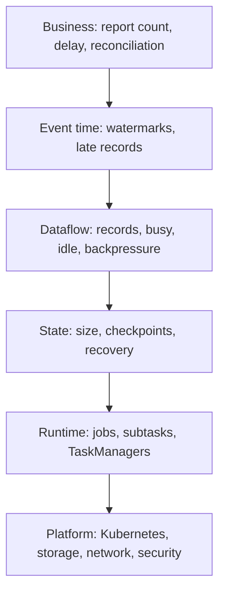
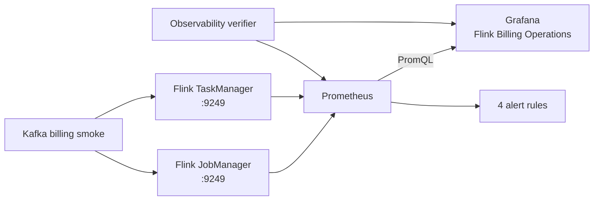

# Flink Observability and Incident Response

Flink exposes runtime health, but business correctness needs its own signals. A `RUNNING` job can still produce no reports, drop late orders, duplicate sink writes, or accumulate state indefinitely.

## Observability layers



An alert should identify its layer and link to a runbook.

## Repository observability stack

The local environment now makes the monitoring path executable:



Start the services and run the combined business and observability acceptance:

```sh
make flink-up
make flink-observability-smoke
make flink-down
```

Open:

- Flink: `http://localhost:8081`
- Prometheus: `http://localhost:9090`
- Grafana: `http://localhost:3000`

The Compose environment enables Flink's Prometheus reporter on both runtime processes:

```yaml
ENABLE_BUILT_IN_PLUGINS: flink-metrics-prometheus-2.2.1.jar

metrics.reporter.prom.factory.class: org.apache.flink.metrics.prometheus.PrometheusReporterFactory
metrics.reporter.prom.port: 9249
```

The environment variable moves the reporter JAR shipped in the Flink image from `opt/` into the plugin directory before the process starts. Configuring only the factory class without enabling that plugin would leave the reporter unavailable.

Prometheus scrapes `jobmanager:9249` and `taskmanager:9249` every five seconds. These service names work inside the Compose network; production service discovery should match the deployment platform.

### Executable acceptance contract

`scripts/flink_observability_smoke.py` queries the real APIs and requires:

- exactly two Flink scrape targets, both `up`
- four named alert rules loaded by Prometheus
- JobManager, running-job, TaskManager backpressure, and operator traffic metrics
- the provisioned Grafana dashboard with exactly six panels

The billing verifier calls this while the unbounded billing job is running. A green static YAML parse alone would not prove that the reporter plugin loaded or that job metrics reached Prometheus.

Expected evidence:

```text
observability smoke: 2 Flink targets up, 4 alert rules loaded,
4 runtime metrics present, 6 dashboard panels provisioned
```

The business verifier still separately proves:

```text
audit fee - too-late fee - report fee = 0.00
audit count - too-late count - report count = 0
```

Prometheus health does not substitute for that ledger reconciliation.

## Minimum dashboard

### Availability

- FlinkDeployment reconciliation state
- job status
- restart count and failure cause
- registered versus expected TaskManagers
- running versus expected subtasks

### Traffic

- source records in
- operator records in/out
- sink records out
- Kafka consumer lag per partition
- sink request latency and errors

### Event time

- `currentInputWatermark`
- `currentOutputWatermark`
- watermark lag relative to expected source time
- `numLateRecordsDropped`
- reconciliation/side-output records
- end-to-end business report delay

### Task activity

- `busyTimeMsPerSecond`
- `idleTimeMsPerSecond`
- `backPressuredTimeMsPerSecond`
- per-subtask CPU and memory
- network buffer usage

### State and recovery

- managed state size per operator/subtask
- completed and failed checkpoints
- time since last completed checkpoint
- checkpoint duration and data size
- barrier/alignment contribution where applicable
- recovery duration

### Platform

- JobManager and TaskManager restarts
- Kubernetes pending/evicted/OOMKilled pods
- checkpoint/object-store errors
- disk, network, memory, and CPU pressure
- certificate, credential, and quota failures

## Alert examples

The repository loads these concrete rules from `environments/flink/observability/flink-alerts.yml`.

```text
up{job="flink"} == 0
```

`FlinkMetricsTargetDown` is critical after one minute. It means Prometheus cannot scrape a runtime process; it does not by itself prove that the process is down.

```text
avg_over_time(flink_taskmanager_job_task_backPressuredTimeMsPerSecond[10m]) > 800
```

`FlinkTaskMostlyBackpressured` warns after the condition remains true for ten minutes. `800 ms/s` means the task spent more than 80% of observed time backpressured.

```text
increase(flink_taskmanager_job_task_operator_numLateRecordsDropped[10m]) > 0
```

`FlinkLateRecordsDetected` warns when a window operator receives a record after its allowed-lateness cleanup boundary. In this pipeline that record is routed to the side output, so “dropped” in Flink's metric name means dropped from normal window computation, not silently discarded.

```text
increase(flink_jobmanager_job_numberOfFailedCheckpoints[10m]) > 0
```

`FlinkCheckpointFailures` is critical on any failed checkpoint in ten minutes.

These initial rules deliberately avoid a fabricated checkpoint-age expression: Flink exposes checkpoint counts and durations, but the repository has not yet added a trustworthy wall-clock timestamp series for “last successful checkpoint.” Add that signal before alerting on staleness.

### Dashboard panels

The provisioned `Flink Billing Operations` dashboard is version-controlled JSON:

| Panel | Question |
| --- | --- |
| Flink scrape targets up | Can Prometheus reach both runtime processes? |
| Current input watermark | Which task is holding back event-time progress? |
| Backpressure per task | Is downstream capacity constraining upstream work? |
| Operator records in per second | Where did traffic stop or skew? |
| Events beyond allowed lateness | Are records leaving the normal billing path? |
| Failed checkpoints | Has recoverability degraded? |

The dashboard is a starting operational view, not an SLO. Production labels, cardinality, retention, notification routes, and business dimensions need workload-specific review.

## Symptom triage

| Symptom | First evidence | Do not assume |
| --- | --- | --- |
| Report missing | job state, source records, per-subtask watermarks | A restart will fix it |
| Watermark old | timestamp samples, partition watermarks, input activity | CPU is saturated |
| Consumer lag rising | busy/backpressure, sink latency, partition skew | More TaskManagers always help |
| Late records rising | producer timestamps, lag, watermark bound | The watermark bound alone is wrong |
| State growing | open windows, watermark, allowed lateness, key count | RocksDB is leaking |
| Checkpoints slow | state size, barrier delay, storage latency | Only checkpoint interval matters |
| One hot subtask | per-subtask keys/records/state | Job-wide average is representative |
| Duplicate output | sink key, retries, replay, source duplicates | Exactly-once exists end to end |

## Runbook: five-minute report does not appear

### Detection

Business report delay exceeds the SLO, while the job may still be `RUNNING`.

### Diagnose

1. Confirm source records are arriving.
2. Confirm the expected event timestamp and window calculation.
3. Inspect `currentInputWatermark` for every window subtask.
4. Find the minimum input watermark and its upstream source split.
5. Check whether that split is active, idle, lagging, or malformed.
6. Compare `currentOutputWatermark`.
7. Check backpressure and downstream sink latency.
8. Check checkpoint/restart history for replay or repeated recovery.
9. Query the sink by `(userId, windowStart)`.

Useful REST shape:

```sh
xh get \
  "$FLINK_REST_URL/jobs/$JOB_ID/vertices/$VERTEX_ID/metrics" \
  get=="currentInputWatermark,currentOutputWatermark,numLateRecordsDropped"
```

### Mitigate

- Repair a failed dependency or blocked sink.
- Correct producer timestamp configuration.
- Restore a failed source partition.
- Add or adjust idleness only after confirming normal traffic gaps.
- Roll back a regression when evidence points to the revision.

Do not advance a watermark manually or increase allowed lateness without deciding the data-correctness consequences.

### Verify

- watermarks resume
- the affected window emits
- no unexpected late/drop spike occurs
- state begins cleaning up
- business output reconciles

## Runbook: late records increase

### Diagnose

1. Sample `timestampTs`, Kafka append time, and Flink processing time.
2. Confirm timestamp unit and timezone.
3. Group lateness by producer and Kafka partition.
4. Check consumer lag and backpressure.
5. Compare observed disorder with `maxOutOfOrderness`.
6. Check whether a formerly idle split reactivated with old events.
7. Inspect `numLateRecordsDropped` and reconciliation side output.

### Mitigate

Choose one explicit policy:

- fix the delayed producer or partition
- increase the disorder bound and accept later reports
- add allowed lateness and emit corrections
- route too-late events to reconciliation
- use an upstream completeness marker

### Verify

Replay representative out-of-order records and confirm:

```text
accepted event -> correct original window
allowed-late event -> correction/upsert
too-late event -> reconciliation path
```

The repository's [Late Data Correction and Reconciliation](../../concepts/flink/event-time/late-data-reconciliation.md) lab performs this sequence against Kafka, Flink, and MySQL. Its balance invariant is:

```text
audited source - explicitly too late - reported accepted = 0
```

For billing, verify both fee and event count. A zero count delta with a non-zero money delta is still an incident.

## Runbook: backpressure or lag

### Diagnose

Start downstream and move upstream:

```text
sink -> window/aggregate -> transformations -> source
```

At each subtask compare:

- records in/out
- busy, idle, and backpressured time
- request/flush latency
- state access latency
- CPU, memory, disk, and network

Typical causes:

- sink rate limit or database lock
- skewed user key or Kafka partition
- expensive serialization
- insufficient network buffers
- state backend IO
- external lookup in the hot path

### Mitigate

- repair or scale the actual bottleneck
- batch/idempotently upsert at the sink
- rescale a compatible operator after planning state movement
- repartition only with a data/state migration plan
- apply source rate control when downstream protection matters

Adding source parallelism while the sink is saturated increases pressure rather than capacity.

## Runbook: checkpoint failure or slowdown

### Diagnose

1. Identify the first failed checkpoint and error.
2. Compare checkpoint duration and data size over time.
3. Compare synchronous, asynchronous, barrier, and upload phases where exposed.
4. Check state growth and per-subtask skew.
5. Check checkpoint storage latency, quota, credentials, and availability.
6. Check backpressure and network buffers.
7. Check TaskManager memory and state backend logs.

### Mitigate

- restore checkpoint storage access
- relieve backpressure
- reduce unbounded state growth
- adjust interval/timeout only from measured duration
- use incremental checkpoints where supported and justified
- roll back a state-growth regression

### Verify

- several checkpoints complete
- failure count stops increasing
- duration returns within SLO
- a failure drill can restore the completed checkpoint

## Runbook: restart loop

1. Freeze deployment automation.
2. Capture job exception, pod termination reason, operator status, and recent changes.
3. Identify deterministic code/data failure versus infrastructure failure.
4. Preserve the last usable checkpoint/savepoint.
5. Quarantine a poison record only through an approved data policy.
6. Roll back code/config when state-compatible.
7. Restore and verify business output.

Do not repeatedly delete pods without understanding whether each restart reprocesses the same failing record.

## Incident record

```yaml
incident:
    id: flink-2026-001
    job: user-fee-report
    startedAt: 2026-07-30T10:05:00Z
    detectedBy: report-delay-alert
    impact: 12:00-12:05 reports delayed
    revision: sha256:REPLACE
    lastCheckpoint: s3://example-flink/checkpoints/REPLACE
    minimumWatermark: 2026-07-30T12:04:10Z
    cause: kafka-partition-7-producer-stalled
    mitigation: producer-restored
    reconciliation: completed
    followUp:
        - add-partition-watermark-dashboard
        - test-idleness-threshold
```

## Official references

- [Flink metrics](https://nightlies.apache.org/flink/flink-docs-release-2.2/docs/ops/metrics/)
- [Debugging event time](https://nightlies.apache.org/flink/flink-docs-release-2.2/docs/ops/debugging/debugging_event_time/)
- [Monitoring backpressure](https://nightlies.apache.org/flink/flink-docs-release-2.2/docs/ops/monitoring/back_pressure/)
- [Task failure recovery](https://nightlies.apache.org/flink/flink-docs-release-2.2/docs/ops/state/task_failure_recovery/)
