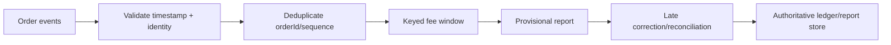
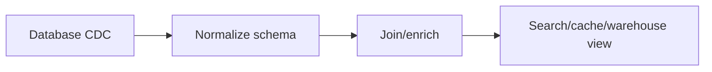

# Real-world Flink Applications

Flink is useful when computation must remain continuously stateful while processing unbounded or frequently arriving data. It is not automatically the best answer for every Kafka consumer or periodic report.

## Selection test

Flink becomes attractive when several are true:

- results must update continuously or with low delay
- event time and out-of-order data matter
- computation maintains large keyed or windowed state
- source replay and consistent recovery matter
- multiple streams must be joined over time
- scale exceeds a simple single-process consumer
- the team can operate checkpoints, state, metrics, and upgrades

A scheduled SQL query, Kafka Streams application, database materialized view, or ordinary service may be simpler when state and latency requirements are modest.

## Pattern: event-time billing and settlement



Flink strengths:

- event-time windows
- out-of-order handling
- keyed incremental state
- replay from source positions
- late-event side outputs

Production requirements:

- globally unique order identity or defined partition sequence scope
- decimal/currency rules
- correction/finality semantics
- idempotent or transactional sink
- reconciliation against the authoritative ledger

Do not make a window aggregate the sole financial ledger without an audit and correction design.

## Pattern: fraud and risk detection

Examples:

```text
many cards used by one device in ten minutes
impossible travel between account logins
rapid payment attempts followed by a large transfer
```

Flink capabilities:

- keyed state
- event-time timers
- pattern detection
- broadcast rules
- stream joins

Operational concerns:

- rule/version auditability
- false-positive and model drift metrics
- state TTL
- hot entities
- explainable alert payload
- exactly which event caused a decision

## Pattern: operational monitoring and alerting

Examples:

```text
service error rate by region
device telemetry threshold
watermark or consumer-lag anomaly
deployment health correlation
```

Flink can aggregate and correlate high-volume telemetry before storing it.

Operational concerns:

- alert deduplication and suppression
- cardinality control
- backpressure during incidents
- event-time versus ingestion-time choice
- dead-letter/reconciliation paths

If the monitoring backend already performs the required aggregation and alerting, another stateful platform may add little value.

## Pattern: change-data-capture materialization



Flink strengths:

- continuous table/view maintenance
- ordered per-key changes
- enrichment and joins
- checkpointed source positions

Operational concerns:

- schema evolution
- snapshot-to-log transition
- delete/tombstone semantics
- sink upsert ordering
- re-bootstrap procedure
- source database retention

## Pattern: stream enrichment

Examples:

```text
orders + customer tier
events + deployment metadata
transactions + exchange rate
```

Choose enrichment mode:

| Mode | Strength | Operational cost |
| --- | --- | --- |
| Broadcast state | Fast local lookup for small changing rules | Every subtask stores the rules |
| Stream-stream join | Event-time-consistent relationship | Retains join state and needs watermark coordination |
| Async external lookup | Current external value | Adds dependency latency, rate limits, timeout, and consistency concerns |
| Pre-enriched producer event | Simplest Flink topology | Duplicates data and shifts correctness to producer |

## Pattern: session and behavior analytics

Session windows group activity separated by inactivity gaps:

```text
user activity -> session window -> page/cart/purchase journey
```

Operational concerns:

- session gap changes business semantics
- late events can merge sessions
- high user cardinality creates state
- privacy and retention requirements
- bot/internal traffic filtering

## Pattern: data quality gateway

Flink can continuously validate:

- schema and required fields
- timestamp range and units
- monotonic sequence expectations
- referential enrichment
- duplicate identity
- domain-specific invariants

Outputs:

```text
valid stream
quarantine stream
quality metrics
reconciliation evidence
```

The quarantine stream needs ownership, retention, alerts, and replay tooling. A dead-letter topic without a consumer is delayed data loss.

## Pattern: online features and models

Flink can compute continuously updated features:

```text
orders in previous hour
average transaction amount
device/account relationship count
recent failure ratio
```

Operational concerns:

- training/serving definition parity
- feature freshness
- point-in-time correctness
- state TTL
- model and feature versioning
- replay cost

## When not to use Flink

Prefer a simpler system when:

- a five-minute scheduled SQL aggregation meets the latency target
- input is naturally bounded and infrequent
- no event-time or continuous state is required
- one database transaction can safely perform the update
- the team cannot yet operate checkpoints and restore procedures
- source and sink throughput fit a small ordinary service
- correctness depends on a ledger/database transaction that Flink cannot replace

Decision example:

| Requirement | Likely fit |
| --- | --- |
| Nightly immutable report | Batch SQL or batch engine |
| Small Kafka topic, per-record stateless transform | Ordinary consumer/service |
| Per-key local stream processing inside one application | Kafka Streams may be sufficient |
| Large stateful joins/windows with event-time disorder | Flink |
| Authoritative balance transfer | Transactional ledger/database, possibly with Flink as a derived view |

## Adoption path

Adopt vertically:

1. Prove event-time and state semantics with bounded data.
2. Add source and sink integration with explicit contracts.
3. Add durable checkpoints and failure recovery.
4. Add dashboards, alerts, and reconciliation.
5. Prove savepoint restore and rollback.
6. Deploy one bounded-scope application.
7. Measure operational cost before adding more jobs.

The repository currently covers step 1 and parts of step 2. The operations handbook defines the evidence required for later steps.

## Architecture review template

```yaml
application:
    problem: five-minute-user-fee-report
    whyStreaming: event-time-corrections-under-two-minutes
    whyFlink: keyed-windows-out-of-order-state-recovery
    simplerAlternativesReviewed:
        - scheduled-sql
        - kafka-consumer
        - kafka-streams

contracts:
    source: order-events-v2
    key: userId
    timestamp: timestampTs-epoch-ms
    output: bill-fee-report-v1
    finality: provisional-then-corrected

operations:
    owner: billing-platform
    rto: 15m
    reportDelaySlo: 2m
    restoreDrill: required
    reconciliation: required
```

## Official references

- [Flink overview](https://nightlies.apache.org/flink/flink-docs-release-2.2/docs/learn-flink/overview/)
- [Flink architecture](https://nightlies.apache.org/flink/flink-docs-release-2.2/docs/concepts/flink-architecture/)
- [Stateful stream processing](https://nightlies.apache.org/flink/flink-docs-release-2.2/docs/concepts/stateful-stream-processing/)
