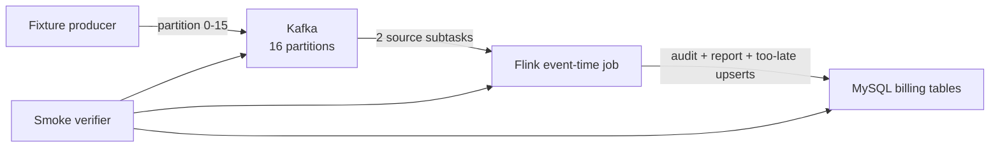

# 16-partition Kafka Billing Pipeline

The earlier labs use in-memory sources so one concept can be observed at a time. This acceptance path runs the same five-minute billing model across actual service boundaries:



Run:

```sh
make flink-up
make flink-billing-smoke
make flink-down
```

The acceptance command requires Podman and permission to access its local VM.

## Verified result

The live repository acceptance produced:

```text
billing smoke: 16 partitions,
corrected report 153.00 / 18 events,
one 9.00 too-late event,
reconciliation delta 0.00 / 0 events
```

This is runtime evidence, not an inference from configuration:

- Kafka topic metadata reported exactly 16 partitions.
- The active consumer group described partitions 0 through 15.
- Two Flink source subtasks shared those 16 partitions.
- MySQL first contained 16 reports totaling `150.00` and 17 events for `[12:00, 12:05)`.
- A `12:03` event published after that first result corrected it to `153.00` and 18 events.
- A later `12:02` event published after state cleanup was routed to the too-late table.
- Audit fee minus too-late fee minus report fee was exactly `0.00`; the count delta was `0`.
- The verifier canceled the unbounded job and deleted its temporary topic.

## Keep the four coordinates separate

An incoming wire event is:

```json
{
    "customerId": "customer-15",
    "sequence": 7,
    "fee": "16.00",
    "occurredAt": "2026-07-30T12:00:10Z"
}
```

Kafka adds physical metadata such as partition and offset. The deserializer combines them into the application record:

```java
new OrderEvent(
        wireEvent.customerId(),
        kafkaRecord.partition(),
        wireEvent.sequence(),
        wireEvent.fee(),
        wireEvent.occurredAt());
```

| Coordinate | Example | Owner | Purpose |
| --- | --- | --- | --- |
| `sourcePartition` | `15` | Kafka record metadata | Physical source lane |
| Kafka offset | `42` | Kafka broker/consumer | Connector recovery cursor |
| `sequence` | `7` | Event producer | Business ordering or gap detection inside one partition |
| `occurredAt` | `12:00:10Z` | Business event | Event-time window assignment |
| `customerId` | `customer-15` | Business domain | Flink keyed state |

`occurredAt`—or `dto.timestampTs` in another DTO—is not the key and is not the recovery cursor.

```java
.withTimestampAssigner(
        (event, previousTimestamp) ->
                event.occurredAt().toEpochMilli())
.keyBy(OrderEvent::customerId)
```

Kafka offsets are checkpointed by the connector. The monotonic sequence remains useful for detecting producer gaps, duplicates, or reordering, but it does not replace the connector offset.

## Why derive the partition from Kafka

The wire payload does not claim its own partition. `OrderEventKafkaDeserializationSchema` reads the authoritative value from `ConsumerRecord.partition()`:

```java
public void deserialize(
        ConsumerRecord<byte[], byte[]> record,
        Collector<OrderEvent> output) throws IOException {
    var wireEvent =
            objectMapper.readValue(record.value(), WireOrderEvent.class);
    output.collect(
            new OrderEvent(
                    wireEvent.customerId(),
                    record.partition(),
                    wireEvent.sequence(),
                    wireEvent.fee(),
                    wireEvent.occurredAt()));
}
```

Trusting a duplicated payload field would allow the producer to disagree with Kafka's actual placement.

## Sixteen partitions versus Flink parallelism

The topic has 16 partitions while the local job has source parallelism 2:

```java
environment.setParallelism(2);

KafkaSource<OrderEvent> source =
        KafkaSource.<OrderEvent>builder()
                .setTopics(settings.getKafkaTopic())
                .setGroupId(settings.getKafkaGroupId())
                .setStartingOffsets(OffsetsInitializer.earliest())
                .setDeserializer(
                        new OrderEventKafkaDeserializationSchema())
                .build();
```

KafkaSource assigns multiple partitions to each source subtask:

```text
16 Kafka partitions / 2 source subtasks
≈ 8 partitions per source subtask
```

The exact assignment is controlled by the connector and consumer group. Sixteen partitions provide an upper bound on useful source parallelism for one topic at that moment; they do not require parallelism 16.

Increasing source parallelism beyond available task slots prevents scheduling. Increasing it beyond the partition count creates idle source subtasks.

After the source, `keyBy(customerId)` performs a separate network partitioning for keyed window state. Kafka partition assignment and keyed-state ownership are related only through the records they carry.

## Fixture data

The fixture producer creates a unique topic and explicitly targets every partition:

```java
for (int partition = 0; partition < 16; partition++) {
    send(producer, topic, partition, event(sequence = 1));
    send(producer, topic, partition, event(sequence = 2));
}
```

Partition 0 has two billable events in the first window:

```text
sequence 1 -> fee 1.00  at 12:00:10
sequence 2 -> fee 14.00 at 12:04:40
sequence 3 -> fee 1.00  at 12:06:00, advances watermark
```

Partitions 1–15 each have one billable event and one 12:06 watermark-advancing event. Therefore:

```text
customer-00 report = 1.00 + 14.00 = 15.00, count 2
customer-01 report = 2.00, count 1
...
customer-15 report = 16.00, count 1

total = 15.00 + (2.00 + ... + 16.00)
      = 150.00
count = 2 + 15
      = 17
```

The next-window events remain open and are not part of the verified report.

The staged correction and reconciliation behavior is explained in [Late Data Correction and Reconciliation](../event-time/late-data-reconciliation/).

## Watermarks across partitions

The job uses bounded out-of-orderness plus idleness:

```java
var watermarks =
        WatermarkStrategy.<OrderEvent>forBoundedOutOfOrderness(
                        Duration.ofSeconds(30))
                .withTimestampAssigner(
                        (event, previousTimestamp) ->
                                event.occurredAt().toEpochMilli())
                .withIdleness(Duration.ofSeconds(3));
```

Each active Kafka partition contributes event-time progress. The operator watermark follows the slowest non-idle upstream input.

The fixture sends a `12:06:00` event to every partition:

```text
maximum observed event time = 12:06:00
out-of-orderness             = 00:00:30
watermark                    ≈ 12:05:30
window end                   = 12:05:00
result                       = window can fire
```

Without those later events, the unbounded job would correctly keep the 12:00 window open. Wall-clock time does not automatically close an event-time window.

Idleness prevents a genuinely quiet partition from holding the global watermark forever. The timeout is a business and operational choice: marking an input idle too aggressively can make a later record late.

## Idempotent report sink

The MySQL table uses the report's natural identity:

```sql
PRIMARY KEY (customer_id, window_start, window_end)
```

The sink writes the complete aggregate:

```sql
INSERT INTO fee_reports (
    customer_id,
    window_start,
    window_end,
    total_fee,
    event_count
)
VALUES (?, ?, ?, ?, ?)
ON DUPLICATE KEY UPDATE
    total_fee = VALUES(total_fee),
    event_count = VALUES(event_count);
```

The connector is configured for at-least-once delivery. Rewriting the same complete report is idempotent for this narrow output model.

This does not make every possible billing sink exactly-once. Append-only invoices, downstream notifications, or incremental `total = total + delta` updates require a different transactional or deduplication contract.

## What the verifier checks

`scripts/flink_billing_smoke.py`:

1. waits for a real TaskManager
2. creates/truncates the report, source-audit, and too-late tables
3. creates a uniquely named 16-partition topic
4. publishes partition-specific monotonic sequences
5. confirms topic metadata says `PartitionCount: 16`
6. submits `BillingPipelineJob`
7. waits for the exact initial MySQL report
8. confirms the consumer group covers partitions `0..15`
9. publishes a late correction and waits for the exact revised report
10. advances the watermark beyond cleanup, then publishes one too-late event
11. checks exact fee and count reconciliation across all three tables
12. cancels the unbounded job
13. deletes the temporary topic

The unique topic and group make repeated executions independent.

## Evidence boundary

This acceptance proves real connector wiring, topic partition coverage, event-time window closure, keyed aggregation, correction upserts, too-late routing, and exact source-to-sink balance in the controlled local Compose fixture.

It does not yet prove:

- checkpoint recovery of the real Kafka job after a TaskManager failure
- committed Kafka offsets and MySQL state remain consistent after failure
- multiple Kafka brokers or replication-factor failure tolerance
- production throughput, backpressure, or checkpoint-storage capacity
- authentication, authorization, TLS, or secret management

The next milestone adds concrete exported metrics, dashboards, and alert rules.

## Source files

- [`BillingPipelineJob.java`](https://github.com/azusachino/flos/blob/main/modules/flink/pipeline-lab/src/main/java/io/github/azusachino/flos/flink/pipeline/BillingPipelineJob.java)
- [`OrderEventKafkaDeserializationSchema.java`](https://github.com/azusachino/flos/blob/main/modules/flink/pipeline-lab/src/main/java/io/github/azusachino/flos/flink/pipeline/OrderEventKafkaDeserializationSchema.java)
- [`BillingFixtureProducer.java`](https://github.com/azusachino/flos/blob/main/modules/flink/pipeline-lab/src/main/java/io/github/azusachino/flos/flink/pipeline/BillingFixtureProducer.java)
- [`flink_billing_smoke.py`](https://github.com/azusachino/flos/blob/main/scripts/flink_billing_smoke.py)

## Official references

- [Kafka connector](https://nightlies.apache.org/flink/flink-docs-release-2.2/docs/connectors/datastream/kafka/)
- [Generating watermarks](https://nightlies.apache.org/flink/flink-docs-release-2.2/docs/dev/datastream/event-time/generating_watermarks/)
- [JDBC connector](https://nightlies.apache.org/flink/flink-docs-release-2.2/docs/connectors/datastream/jdbc/)
