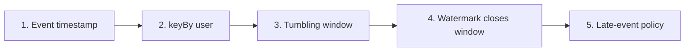
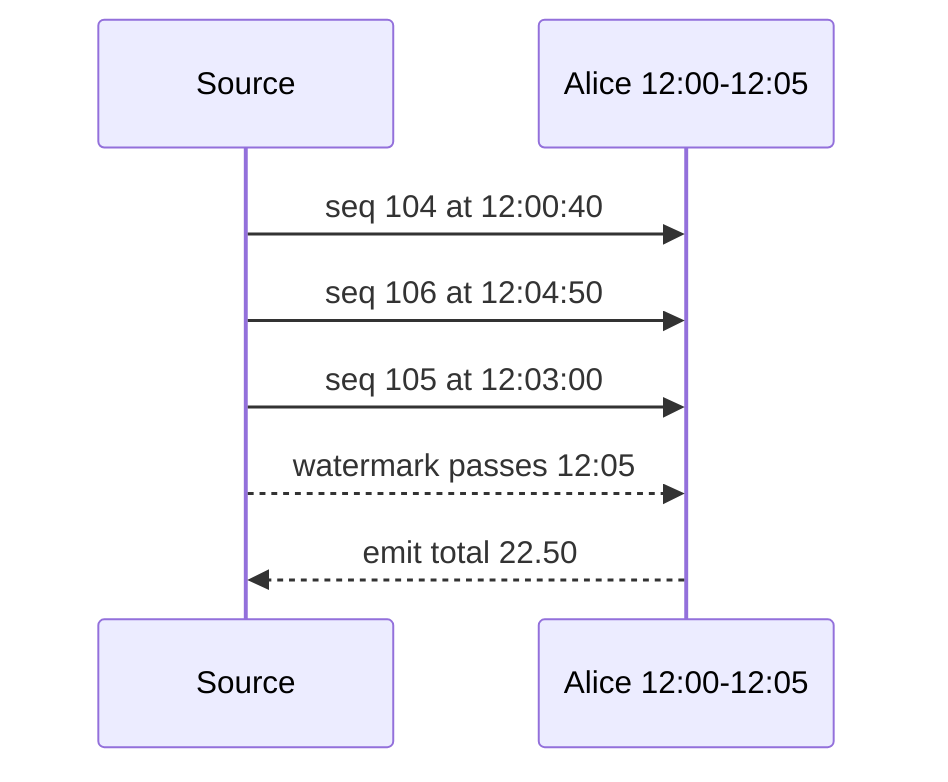

# Event Time Fundamentals

This lab deliberately has no Kafka, database, or deployment configuration. Its only question is:

> How does Flink turn out-of-order order events into one fee total per user per five-minute business-time period?

Learn the concepts in this order:



## Three notions of time

An order event carries `occurredAt`, such as `12:03:00`. That is **event time**: when the business event happened.

**Processing time** is when Flink happens to handle the record. An event that happened at `12:03` might reach Flink at `12:04`.

A **watermark** is neither of those clocks. It is Flink's estimate of progress through event time.

```text
occurredAt       12:03:00   business fact inside the event
processing time  12:04:02   when this machine handles it
watermark        12:03:40   earlier event times are now considered late
```

## Step 1: assign event timestamps

The lab tells Flink to use `occurredAt`:

```java
var watermarks =
        WatermarkStrategy.<OrderEvent>forBoundedOutOfOrderness(
                        Duration.ofSeconds(30))
                .withTimestampAssigner(
                        (event, previousTimestamp) ->
                                event.occurredAt().toEpochMilli());
```

The timestamp assigner answers “when did this order happen?” The watermark generator separately answers “how far through event time have we progressed?”

## Step 2: group by user

```java
.keyBy(OrderEvent::customerId)
```

`keyBy` ensures every Alice event reaches the same logical keyed operator. It does not create a time period and it does not preserve one global input order.

Flink can now maintain independent state:

```text
alice -> her open windows
bob   -> his open windows
```

## Step 3: assign a tumbling window

```java
.window(TumblingEventTimeWindows.of(Duration.ofMinutes(5)))
```

Tumbling windows are fixed, adjacent, and non-overlapping:

```text
[12:00, 12:05) [12:05, 12:10) [12:10, 12:15)
```

Each event belongs to exactly one window:

```text
12:04:59.999 -> [12:00, 12:05)
12:05:00.000 -> [12:05, 12:10)
```

The repository test calls Flink's real `TumblingEventTimeWindows` assigner and verifies this boundary.

## Step 4: aggregate while the window is open

The lab receives Alice's records in this arrival order:

```text
arrival   sequence   occurredAt   fee
1         104        12:00:40     10.00
2         106        12:04:50      5.00
3         105        12:03:00      7.50
```

Sequence 105 arrives after 106, but all three timestamps belong to the same window:

```text
alice + [12:00, 12:05) = 10.00 + 5.00 + 7.50 = 22.50
```

The aggregate stores only a running total and count:

```java
public FeeAccumulator add(OrderEvent event, FeeAccumulator accumulator) {
    return new FeeAccumulator(
            accumulator.totalFee().add(event.fee()),
            accumulator.eventCount() + 1);
}
```

## Step 5: close the window with a watermark

The job allows 30 seconds of timestamp disorder. Conceptually:

```text
watermark ≈ greatest observed event timestamp - 30 seconds
```

After observing `12:04:50`, the watermark can approach `12:04:20`. The event at `12:03:00` is now behind the watermark and would be late if it had not already been processed before that watermark was emitted.

After observing `12:05:31`, the watermark can pass `12:05`. Flink may then emit the `12:00–12:05` window.



Watermarks are emitted periodically. The configured 30 seconds is therefore a completeness policy, not an exact output timer.

## Multiple source partitions

With several active inputs, downstream event-time progress follows the slowest watermark:

```text
partition 0 watermark = 12:05:10
partition 1 watermark = 12:04:20
effective watermark   = 12:04:20
```

The first window stays open because partition 1 might still provide an event before `12:05`.

For a sparse source, `withIdleness(timeout)` marks a quiet partition idle so it temporarily stops holding back the minimum. Idleness does not advance time by itself; if every input stops, no new event timestamp advances the watermark.

## Late events are a business decision

An event is late when it belongs to a window whose end has already been passed by the watermark.

Possible policies include:

- drop it;
- retain the window with allowed lateness and emit a correction;
- send it to a side output for reconciliation;
- wait for an explicit upstream completeness signal.

Billing should not silently choose one. This lab first teaches the boundary; a later topic will implement and compare the policies.

## Run the lab

```sh
make flink-event-time
```

Expected totals include:

```text
alice [12:00, 12:05) total=22.50 count=3
alice [12:05, 12:10) total=3.00 count=1
bob   [12:00, 12:05) total=4.00 count=1
```

Because the source is bounded, Flink emits a final maximum watermark when the input ends. That closes every remaining window. A Kafka source is unbounded and therefore depends continuously on its configured watermark policy.

## Exercises

1. Change Alice sequence 105 to `occurredAt=12:05:00` and predict its window before running the test.
2. Change the window size to ten minutes and write down the new boundaries.
3. Change the disorder bound to ten seconds and explain which arrival patterns become late.
4. Add a third user and verify that `keyBy` keeps the totals independent.
