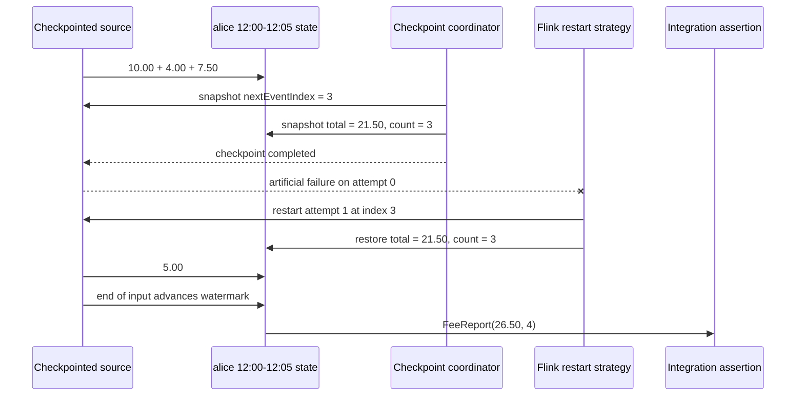

# Checkpoint and Recovery Lab

The event-time lab proves how events enter clock-aligned windows. This lab answers the next operational question:

> What happens to an open five-minute billing window when a Flink task fails?

The job takes a checkpoint after three events, deliberately fails its source, restarts once, restores the source offset and window accumulator, consumes the fourth event, and emits one correct report.

Run it:

```sh
make flink-recovery
```

The test starts an embedded Flink MiniCluster and needs permission to bind local ephemeral ports.

## Workflow



## Why both states matter

Flink restores a consistent snapshot of the entire dataflow:

| State | Checkpoint value | Why it matters |
| --- | --- | --- |
| Source operator state | `nextEventIndex = 3` | Resume from the fourth event instead of replaying the whole finite input |
| Window keyed state | `totalFee = 21.50`, `eventCount = 3` | Preserve Alice's still-open 12:00–12:05 accumulator |

Restoring only one side would be wrong:

```text
window restored, source starts at 0  -> first three events counted twice
source restored, window starts empty -> first three events disappear
both restored consistently           -> 26.50 across four events
```

Kafka uses the same principle at a larger scale: a checkpoint binds Kafka partition offsets to operator state. The `(partition, sequence)` fields in this lab explain source identity, but Flink's checkpointed source offset—not `dto.timestampTs` and not the sequence field—is the recovery cursor.

## Job configuration

The lab uses one restart after a fixed zero-duration delay:

```java
var configuration = new Configuration();
configuration.set(RestartStrategyOptions.RESTART_STRATEGY, "fixed-delay");
configuration.set(RestartStrategyOptions.RESTART_STRATEGY_FIXED_DELAY_ATTEMPTS, 1);
configuration.set(
        RestartStrategyOptions.RESTART_STRATEGY_FIXED_DELAY_DELAY,
        Duration.ZERO);

var environment =
        StreamExecutionEnvironment.getExecutionEnvironment(configuration);
environment.setParallelism(1);
environment.setMaxParallelism(16);
environment.enableCheckpointing(20);
environment.getCheckpointConfig().setCheckpointTimeout(10_000);
```

The 20-millisecond interval makes the local experiment fast. It is not a recommended production interval. Production intervals must account for state size, storage throughput, recovery-point objective, source replay capacity, and sink transactions.

`setMaxParallelism(16)` fixes the number of key groups for this lesson. It does not mean the job runs 16 subtasks, and it is independent of the example's source-partition values.

## Stable operator identities

State is mapped back to operators by UID:

```java
return environment
        .addSource(source, "checkpointed-order-source")
        .uid("billing-order-source-v1")
        .assignTimestampsAndWatermarks(watermarks)
        .uid("billing-event-time-v1")
        .keyBy(OrderEvent::customerId)
        .window(TumblingEventTimeWindows.of(Duration.ofMinutes(5)))
        .aggregate(new FeeAggregate(), new FeeWindow())
        .uid("billing-five-minute-fee-v1");
```

Display names can change. Stateful UIDs should be treated as persistent schema identifiers because checkpoints and savepoints use them to find the state belonging to the new job graph.

## Checkpoint-aware source

The source keeps the next unread list index as operator state:

```java
@Override
public List<Integer> snapshotState(long checkpointId, long timestamp) {
    return Collections.singletonList(nextEventIndex);
}

@Override
public void restoreState(List<Integer> state) {
    nextEventIndex = state.get(0);
}
```

It waits until Flink confirms checkpoint completion before failing:

```java
if (firstAttempt && nextEventIndex == failureAfterEvents) {
    awaitCompletedCheckpoint();
    throw new ArtificialFailureException(
            "failure after checkpointed event " + nextEventIndex);
}

@Override
public void notifyCheckpointComplete(long checkpointId) {
    checkpointCompleted = true;
}
```

Waiting matters. A snapshot that started but never completed is not a valid recovery point.

The production Kafka connector already implements checkpoint-aware offset handling. Application code should use the connector rather than reproduce this teaching source.

## What the assertion proves

```java
assertThat(reports)
        .singleElement()
        .satisfies(report -> {
            assertThat(report.totalFee()).isEqualByComparingTo("26.50");
            assertThat(report.eventCount()).isEqualTo(4);
        });
```

The result is stronger than a unit test:

- a real embedded JobManager and TaskManager execute the topology
- a checkpoint completes before the injected exception
- Flink restarts the failed job
- the source continues from restored operator state
- the open event-time window continues from restored keyed state
- end-of-input advances the watermark and closes the window
- exactly one final report is observed by the collector

The expected total is:

```text
10.00 + 4.00 + 7.50 + 5.00 = 26.50
```

## What it does not prove

This lab does not yet prove:

- durable checkpoint recovery after losing the entire process or machine
- Kafka's real 16-partition offset restoration
- transactional or idempotent database writes
- exactly-once behavior across an external sink
- production checkpoint latency or storage capacity
- high-availability JobManager recovery
- savepoint compatibility across application revisions

Those require external checkpoint storage, real connectors, process-level failure injection, and sink reconciliation. The operations handbook's [Recovery, Upgrade, and Rescaling](../../../operations/flink/recovery-upgrade-rescaling/) page describes that broader drill.

## Source files

- [`CheckpointRecoveryLabJob.java`](https://github.com/azusachino/flos/blob/main/modules/flink/checkpoint-recovery-lab/src/main/java/io/github/azusachino/flos/flink/recovery/CheckpointRecoveryLabJob.java) assembles the job and recovery configuration.
- [`CheckpointedOrderSource.java`](https://github.com/azusachino/flos/blob/main/modules/flink/checkpoint-recovery-lab/src/main/java/io/github/azusachino/flos/flink/recovery/CheckpointedOrderSource.java) snapshots the input cursor and injects the failure.
- [`CheckpointRecoveryLabTest.java`](https://github.com/azusachino/flos/blob/main/modules/flink/checkpoint-recovery-lab/src/test/java/io/github/azusachino/flos/flink/recovery/CheckpointRecoveryLabTest.java) verifies the recovered billing result.

## Official references

- [Checkpointing](https://nightlies.apache.org/flink/flink-docs-release-2.2/docs/ops/state/checkpoints/)
- [Production readiness](https://nightlies.apache.org/flink/flink-docs-release-2.2/docs/ops/production_ready/)
- [Savepoints](https://nightlies.apache.org/flink/flink-docs-release-2.2/docs/ops/state/savepoints/)
