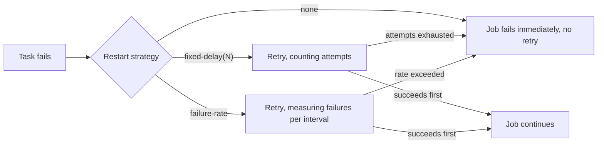

# Restart Strategies and the Give-Up Boundary

The [checkpoint recovery lab](../checkpoint-recovery/) proves a job recovers state after one failure. It quietly configures `fixed-delay` with exactly one retry attempt — enough for that lab, but it never asks the more operationally important question:

> How many times does Flink actually retry before giving up, and does "giving up" even happen unless someone configures it to?



## Source code map

The example is not only documentation. Its complete source is under `modules/flink/restart-strategy-lab`:

| File | What to learn from it |
| --- | --- |
| [`FlakySource.java`](https://github.com/azusachino/flos/blob/main/modules/flink/restart-strategy-lab/src/main/java/io/github/azusachino/flos/flink/restart/FlakySource.java) | Fails on command for a configurable number of attempts, using Flink's own attempt counter |
| [`RestartStrategyLabJob.java`](https://github.com/azusachino/flos/blob/main/modules/flink/restart-strategy-lab/src/main/java/io/github/azusachino/flos/flink/restart/RestartStrategyLabJob.java) | Builds a `Configuration` for `none`, `fixed-delay`, or `failure-rate` |
| [`RestartStrategyLabTest.java`](https://github.com/azusachino/flos/blob/main/modules/flink/restart-strategy-lab/src/test/java/io/github/azusachino/flos/flink/restart/RestartStrategyLabTest.java) | Proves recovery, exhausted-attempts failure, and rate-exceeded failure |

## A source that fails on command

```java
int attempt = getRuntimeContext().getTaskInfo().getAttemptNumber();
if (succeedOnAttempt < 0 || attempt < succeedOnAttempt) {
    throw new ArtificialFailureException("attempt " + attempt + " fails on purpose");
}
```

`getTaskInfo().getAttemptNumber()` is Flink's own counter: `0` for the original execution, `1` for the first restart, and so on. `FlakySource` uses it to fail every attempt below a threshold, then run to completion — or, with a negative threshold, fail on every attempt forever, to prove a strategy's give-up behavior rather than its recovery behavior. The [checkpoint recovery lab's](../checkpoint-recovery/) `CheckpointedOrderSource` uses the same counter to fail exactly once, on the first attempt only; this lab generalizes it to fail a configurable number of times.

## Configuring a restart strategy is a `Configuration`, not a fluent call

```java
public static Configuration fixedDelay(int attempts, Duration delay) {
    var configuration = new Configuration();
    configuration.set(RestartStrategyOptions.RESTART_STRATEGY, "fixed-delay");
    configuration.set(RestartStrategyOptions.RESTART_STRATEGY_FIXED_DELAY_ATTEMPTS, attempts);
    configuration.set(RestartStrategyOptions.RESTART_STRATEGY_FIXED_DELAY_DELAY, delay);
    return configuration;
}
```

Same pattern as the [state TTL and backend lab's](./ttl-and-backends/) backend selection: no fluent environment setter, just `Configuration` keys passed to `StreamExecutionEnvironment.getExecutionEnvironment(configuration)`.

| Strategy | Give-up trigger | Extra knobs |
| --- | --- | --- |
| `none` | Any failure | None — there is no retry to configure |
| `fixed-delay` | More failures than `attempts` | A fixed `delay` between every retry |
| `failure-rate` | More than `max-failures-per-interval` failures inside `failure-rate-interval` | `delay` between retries, independent of the rate window |
| `exponential-delay` | More than `attempts-before-reset-backoff` failures before the backoff resets | Backoff grows from `initial-backoff` toward `max-backoff`, with jitter |

## The gotcha: there may be no safety net unless checkpointing is on

Flink's own default is easy to misread as "always safe": _if checkpointing is disabled, the default restart strategy is `none`_ — one failure ends the job, full stop. Only when checkpointing is enabled does the default become `exponential-delay`. A job with no explicit `RESTART_STRATEGY` and no `enableCheckpointing()` call has no retry safety net at all, silently, by default — worth checking explicitly rather than assuming.

## Three outcomes, one source

```java
// Recovers: attempts 0 and 1 fail on purpose, attempt 2 succeeds, well within 3 configured retries.
RestartStrategyLabJob.fixedDelay(3, Duration.ofMillis(50));
RestartStrategyLabJob.build(env, events, /* succeedOnAttempt= */ 2);

// Gives up: the source never succeeds, and only 2 retries (3 total attempts) are configured.
RestartStrategyLabJob.fixedDelay(2, Duration.ofMillis(50));
RestartStrategyLabJob.build(env, events, /* succeedOnAttempt= */ -1);

// Gives up differently: the source never succeeds, and more than 2 failures land inside the
// 10-second measurement window -- attempt count never enters into it.
RestartStrategyLabJob.failureRate(2, Duration.ofSeconds(10), Duration.ofMillis(20));
RestartStrategyLabJob.build(env, events, /* succeedOnAttempt= */ -1);
```

Both "gives up" tests fail for genuinely different reasons — one counts attempts, the other counts failures within a time window — but the observable outcome from the caller's side is identical: `executeAndCollect` throws, wrapping `FlakySource`'s `ArtificialFailureException` as the root cause. A production job's monitoring cannot tell which give-up trigger fired from the final job status alone; that distinction only lives in which restart strategy was configured.

## What's proven, what's not

| Test | Proves |
| --- | --- |
| `noRestartStrategyFailsOnTheFirstAttempt` | With no restart strategy, one failure ends the job — there is no implicit retry |
| `fixedDelayRecoversWithinConfiguredAttempts` | A job recovers when it succeeds before exhausting its configured retries |
| `fixedDelayGivesUpAfterExhaustingAttempts` | A job that never succeeds is declared failed once attempts run out, not retried forever |
| `failureRateGivesUpAfterExceedingTheRate` | The same give-up guarantee holds under a failure-rate strategy, triggered by a different condition |

All four tests run a real local job to real completion or real failure — there is no mocking of Flink's restart machinery. What none of them prove: real production failure modes (a crashed TaskManager, a network partition) restart through the same mechanism but on a different timeline than an in-process artificial exception; the _policy_ is proven here, not production-scale failure latency.

## Run the lab

```sh
make flink-restart-strategy
```

The bundled `main()` configures `fixed-delay(3, 200ms)` against a source that fails twice and succeeds on the third attempt. Expect two failure log lines, then both events printed.

## Exercises

1. Change `succeedOnAttempt` to `3` against `fixedDelay(2, ...)` and predict whether the job recovers or gives up.
2. Configure `exponential-delay` with a source that fails 4 times before succeeding, and predict whether the growing backoff changes the _outcome_ (recovers vs. fails) compared to `fixed-delay` with the same attempt count — or only the _timing_.
3. `fixedDelayGivesUpAfterExhaustingAttempts` configures 2 retries (3 total attempts). Change `FlakySource` to succeed exactly on attempt 3 instead of never succeeding, and confirm the job now recovers instead of failing — right at the boundary this test currently proves is a failure.
4. Remove `enableCheckpointing(...)` from a job that relies on the default restart strategy and confirm which strategy is actually active — read it back from the running job's configuration rather than assuming.

## What's next

This lab proves the retry _policy_ in isolation from state. The [checkpoint recovery lab](../checkpoint-recovery/) proves the complementary half: that state actually survives a restart once one happens. A production job depends on both being correct together.
