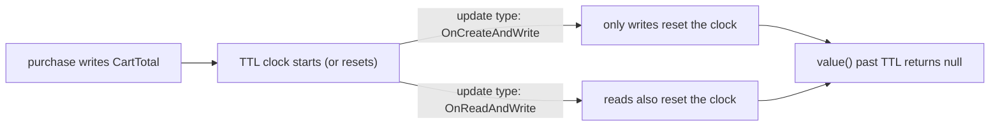
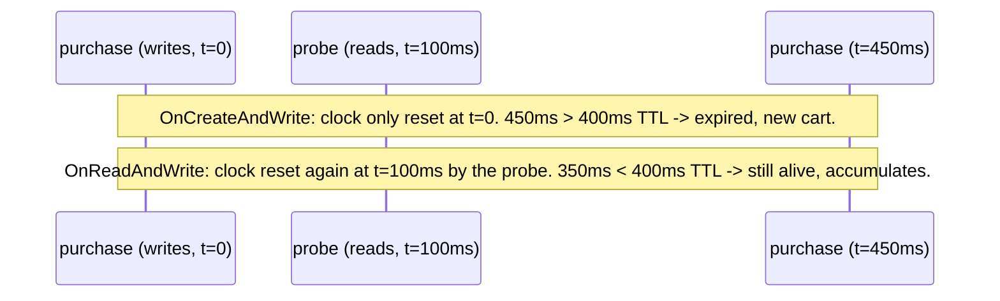

# Keyed State TTL and Backend Choice

Every prior Flink lab in this project keeps state forever, for the lifetime of the job. Real keyed state usually shouldn't: an abandoned shopping cart, an idle session, a stale join buffer all need to expire on their own. This lab's only questions are:

> Does _reading_ state count as activity that keeps it alive, or only _writing_? And once a cart expires, does swapping the whole storage engine underneath it change the answer?



## Source code map

The example is not only documentation. Its complete source is under `modules/flink/state-ttl-lab`:

| File | What to learn from it |
| --- | --- |
| [`CartTotalFunction.java`](https://github.com/azusachino/flos/blob/main/modules/flink/state-ttl-lab/src/main/java/io/github/azusachino/flos/flink/state/CartTotalFunction.java) | Reads and writes one `ValueState<CartTotal>` per customer, wrapped with TTL |
| [`CartActivity.java`](https://github.com/azusachino/flos/blob/main/modules/flink/state-ttl-lab/src/main/java/io/github/azusachino/flos/flink/state/CartActivity.java) | A purchase writes; a probe only reads, to make the update-type difference observable |
| [`StateTtlLabJob.java`](https://github.com/azusachino/flos/blob/main/modules/flink/state-ttl-lab/src/main/java/io/github/azusachino/flos/flink/state/StateTtlLabJob.java) | Selects the state backend entirely through `Configuration`, not a fluent API call |
| [`StateTtlLabTest.java`](https://github.com/azusachino/flos/blob/main/modules/flink/state-ttl-lab/src/test/java/io/github/azusachino/flos/flink/state/StateTtlLabTest.java) | Proves accumulation, expiry, both update types side by side, and backend equivalence |

## Reading state is what triggers expiry

```java
CartTotal current = cartState.value();
boolean startedNewOrExpiredCart = current == null;
```

`value()` is not a passive getter. Internally, Flink compares this entry's last-access timestamp against the configured TTL _at the moment you call it_, using `System.currentTimeMillis()` by default. A `null` result means one of two things: this customer has never purchased, or their previous cart's TTL had already elapsed. The function can't tell which, and doesn't need to — either way, the correct behavior is to start a new cart.

## Update type: does a read count as activity?

```java
StateTtlConfig.newBuilder(Duration.ofMillis(400))
        .updateTtlOnCreateAndWrite()   // or .updateTtlOnReadAndWrite()
        .neverReturnExpired()
        .build();
```

| Update type | A write does | A read does |
| --- | --- | --- |
| `OnCreateAndWrite` | Resets the TTL clock | Nothing — the clock keeps counting from the last write |
| `OnReadAndWrite` | Resets the TTL clock | Also resets the TTL clock |

`CartActivity` models this with two kinds of events sharing one type: a purchase always writes; a probe only calls `value()` to check the current total, the way a health check or a dashboard query might, without adding a real purchase. `probeDoesNotExtendTtlUnderOnCreateAndWrite` and `probeExtendsTtlUnderOnReadAndWrite` run the _identical_ timed sequence — purchase, probe 100ms later, purchase 350ms after that, 400ms TTL — and get opposite outcomes:



Neither answer is "more correct." `OnCreateAndWrite` is right when only genuine writes should count as activity — a truly idle cart should expire even if something keeps polling it. `OnReadAndWrite` is right when access itself is a signal of continued interest, like a session that should stay alive as long as someone is still looking at it.

## A test detail worth noticing: where the sleep lives

The activities in this lab carry a `delayBeforeMillis`, applied inside `CartTotalFunction.processElement` immediately before the state is touched — not inside the source before an event is emitted. A `keyBy` sits between the two, and that shuffle can buffer and batch records; a source that sleeps between `collect()` calls does not reliably reproduce the same wall-clock gap at the point TTL is actually evaluated downstream. Sleeping exactly where the TTL check happens removes that uncertainty entirely. This is the same lesson as the [Netty backpressure lab](/concepts/netty/backpressure/) from a different angle: proving a real-time property requires controlling time at the place the property is actually checked, not somewhere upstream of it.

## Visibility: what a stale value looks like before cleanup

```java
.neverReturnExpired()          // value() returns null once TTL has logically passed
.returnExpiredIfNotCleanedUp()  // value() keeps returning the stale value until physical cleanup runs
```

This lab always configures `neverReturnExpired()`, because it wants `value()` to answer "is this cart still alive?" truthfully at read time. `returnExpiredIfNotCleanedUp()` exists for the opposite case: when a slightly stale read is an acceptable trade for avoiding the cost of checking expiry on every single access — the value can still be logically expired, just not yet removed from the backend's storage.

## The same logic behind two backends

```java
var configuration = new Configuration();
configuration.set(StateBackendOptions.STATE_BACKEND, stateBackend); // "hashmap" or "rocksdb"
var env = StreamExecutionEnvironment.getExecutionEnvironment(configuration);
```

Flink 2.x removed the fluent `env.setStateBackend(...)` call entirely; the backend is now selected purely through configuration, by a shortcut name (`"hashmap"`, `"rocksdb"`, or `"forst"`). `hashMapAndRocksDbBackendsProduceIdenticalOutput` runs the exact same job — same activities, same TTL config — through `HashMapStateBackend` and `EmbeddedRocksDBStateBackend`, and asserts byte-for-byte identical output.

|  | HashMap backend | RocksDB backend |
| --- | --- | --- |
| Where state lives | Java objects on the JVM heap | Serialized bytes in an embedded RocksDB instance, mostly off-heap |
| Access cost | Fast: direct object reference | Slower: (de)serialize on every read and write |
| State size limit | Bounded by available heap | Bounded by local disk |
| Checkpoint cost | Full snapshot every time (unless changelog is enabled) | Supports incremental checkpoints — only changed SST files are uploaded |
| When to prefer it | Small state, latency-sensitive jobs | Large state that would not fit in heap |

The test proves the two backends are _logically_ interchangeable for this job — same TTL semantics, same accumulation, same expiry behavior. It does not, and cannot, prove they perform the same; that trade-off is an operational decision made from state size and latency requirements, not something a unit test verifies.

## What's proven, what's not

| Test | Proves |
| --- | --- |
| `accumulatesWithoutCrossingTtl` | Normal accumulation logic is correct when TTL never enters the picture |
| `stateExpiresAfterTtlUnderNeverReturnExpired` | A cart genuinely expires after real elapsed time exceeds the configured TTL |
| `probeDoesNotExtendTtlUnderOnCreateAndWrite` | Reads do not reset the TTL clock under `OnCreateAndWrite` |
| `probeExtendsTtlUnderOnReadAndWrite` | The identical schedule survives instead, under `OnReadAndWrite` |
| `hashMapAndRocksDbBackendsProduceIdenticalOutput` | The job's output is backend-agnostic |

All five tests use real `Thread.sleep` rather than a virtual clock: Flink's default `TtlTimeProvider` is `System::currentTimeMillis`, with no public hook to mock it, so a short bounded real wait is the honest way to prove this boundary — the same trade-off this project already made for [Netty's connection lifecycle lab](/concepts/netty/connection-lifecycle/).

## Run the lab

```sh
make flink-state-ttl
```

Expect a new cart for Alice, an accumulation, and then a reset once the 500ms gap exceeds the 300ms TTL:

```text
CartSnapshot[customerId=alice, total=10.00, count=1, startedNewOrExpiredCart=true]
CartSnapshot[customerId=alice, total=25.00, count=2, startedNewOrExpiredCart=false]
CartSnapshot[customerId=alice, total=5.00, count=1, startedNewOrExpiredCart=true]
```

## Exercises

1. Change the lab's TTL from 300ms to 600ms and predict whether the final purchase still starts a new cart.
2. Add a second customer, `"bob"`, interleaved with Alice's activities, and confirm `keyBy` keeps their TTL clocks independent.
3. Switch `neverReturnExpired()` to `returnExpiredIfNotCleanedUp()` in the expiry test and predict what `cartState.value()` returns immediately after the TTL has passed but before any cleanup has run.
4. `CartTotalFunction` never configures any TTL cleanup strategy (incremental cleanup, RocksDB compaction filter). Look up `StateTtlConfig.Builder.cleanupIncrementally` and explain what silently keeps expired-but-unread entries occupying memory or disk without it.

## What's next

This lab proves keyed state TTL against two backends, in isolation from checkpointing. The [checkpoint recovery lab](../checkpoint-recovery/) and [savepoint upgrade lab](../savepoint-upgrade/) prove the complementary half: that state survives a restart or a rescale at all. A production job needs both properties at once.
