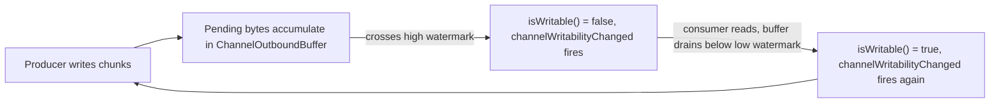

# Netty Backpressure and Flow Control

The [framing lab](../framing/) guaranteed a handler sees whole messages. It said nothing about what happens if a handler produces messages faster than the other side can accept them. This lab's only question is:

> If a consumer stops reading, how does a well-behaved producer find out, and how does it recover once the consumer catches up?



## Source code map

The example is not only documentation. Its complete source is under `modules/netty/backpressure-lab`:

| File | What to learn from it |
| --- | --- |
| [`BackpressureLabServer.java`](https://github.com/azusachino/flos/blob/main/modules/netty/backpressure-lab/src/main/java/io/github/azusachino/flos/netty/backpressure/BackpressureLabServer.java) | Configures `WRITE_BUFFER_WATER_MARK` and wires the throttled producer |
| [`ThrottledProducerHandler.java`](https://github.com/azusachino/flos/blob/main/modules/netty/backpressure-lab/src/main/java/io/github/azusachino/flos/netty/backpressure/ThrottledProducerHandler.java) | Writes while writable, stops, and resumes from `channelWritabilityChanged` |
| [`BackpressureTest.java`](https://github.com/azusachino/flos/blob/main/modules/netty/backpressure-lab/src/test/java/io/github/azusachino/flos/netty/backpressure/BackpressureTest.java) | Proves the raw watermark mechanism, the handler's pause/resume bookkeeping, and a real slow consumer |

## Nobody blocks; a buffer fills instead

Netty's I/O is non-blocking end to end: `ctx.write(msg)` never waits for the socket to accept bytes. It hands the message to that channel's `ChannelOutboundBuffer`, which tracks how many bytes are queued but not yet confirmed sent. If a consumer keeps reading, this buffer stays small. If it stops — a slow client, a paused peer, a saturated network — pending bytes accumulate with nothing to stop them, unless the producer is watching.

## The watermark, proven directly

```java
channel.config().setOption(ChannelOption.WRITE_BUFFER_WATER_MARK, new WriteBufferWaterMark(1024, 2048));

for (int i = 0; i < 3; i++) {
    channel.write(Unpooled.wrappedBuffer(new byte[1024]));
}
assertThat(channel.isWritable()).isFalse();

channel.flush();
assertThat(channel.isWritable()).isTrue();
```

`writabilityFlipsAtTheConfiguredWatermarks` calls `write()` three times without ever calling `flush()` — 3072 bytes accumulate, crossing the 2048-byte high watermark, and `isWritable()` flips to `false` immediately, during the third `write()` call. No socket, no thread, no timing is involved: this is `ChannelOutboundBuffer`'s own bookkeeping. `flush()` then drains everything at once, dropping pending bytes below the 1024-byte low watermark, and writability returns.

Low and high watermarks are deliberately different values (hysteresis): without a gap, a producer sitting exactly at one number could flap between writable and not writable on every single byte.

## A producer that respects the signal

```java
private void produce(ChannelHandlerContext ctx) {
    while (ctx.channel().isWritable() && bytesSent.get() < totalBytes) {
        ctx.write(Unpooled.wrappedBuffer(new byte[chunkSize]));
        bytesSent.addAndGet(chunkSize);
    }
    ctx.flush();
}

@Override
public void channelWritabilityChanged(ChannelHandlerContext ctx) {
    if (ctx.channel().isWritable()) {
        resumedCount.incrementAndGet();
        produce(ctx);
    } else {
        pausedCount.incrementAndGet();
    }
    ctx.fireChannelWritabilityChanged();
}
```

`ThrottledProducerHandler` checks `isWritable()` before every chunk. When the buffer crosses the high watermark mid-loop, the loop condition itself stops production — no separate flag needed. Production only resumes when Netty calls back into `channelWritabilityChanged` with `isWritable() == true`, which happens automatically once pending bytes drop below the low watermark. The handler never polls; it reacts to the same event Netty already fires for exactly this purpose.

## What's proven, what's not

| Test | Proves | Limitation |
| --- | --- | --- |
| `writabilityFlipsAtTheConfiguredWatermarks` | The watermark thresholds and hysteresis work exactly as configured | No handler logic involved |
| `throttledProducerPausesAndResumesAcrossTheFullPayload` (`EmbeddedChannel`) | The handler's pause/resume bookkeeping is correct and every byte is eventually sent | `EmbeddedChannel.flush()` drains instantly, so the "pause" never actually lasts — it proves the transitions fire, not that they hold under real delay |
| `realSocketProducerPausesUnderARealSlowConsumer` | A real client that delays reading causes a real, lasting pause before eventually receiving all 8&nbsp;MB | Depends on the OS's socket buffer sizes being smaller than the payload — true by default, but not a language guarantee |

The gap between the second and third test is the same gap the [event loop lab](../event-loop/) first drew: `EmbeddedChannel` proves Netty's own bookkeeping deterministically; only a real socket proves the bookkeeping actually holds a producer back while bytes are physically in flight.

## Run the lab

```sh
make netty-backpressure
```

The process listens on port `9002` and immediately starts sending 8&nbsp;MB in 8&nbsp;KB chunks to whatever connects. Connect and read slowly to watch it pause and resume:

```sh
nc localhost 9002 | pv -L 64K > /dev/null
```

(`pv -L 64K` throttles the read rate to 64&nbsp;KB/s if installed; without it, `nc ... | cat > /dev/null` still receives everything, just without an artificial slow reader to visibly trigger a pause.)

## Exercises

1. Lower `HIGH_WATERMARK` to `16 * 1024` and predict whether `pausedCount` increases or decreases for the same 8&nbsp;MB payload.
2. Remove the `while` loop's `isWritable()` check entirely, keeping only the `bytesSent.get() < totalBytes` condition. Predict what happens to memory usage against a consumer that never reads.
3. `produce()` calls `ctx.flush()` unconditionally after its loop, even when the loop stopped because the channel became unwritable. Is that flush ever able to send more bytes in that case? Why is it still safe to call?
4. Change the real-socket test's `Thread.sleep(500)` to `0`. Does `pausedCount` reliably stay above zero, and what does that imply about how much of the pause depends on timing versus payload size?

## What's next

This lab throttles a healthy connection. It says nothing about a connection that goes idle, disconnects, or needs to reconnect — the next lab covers connection lifecycle.
