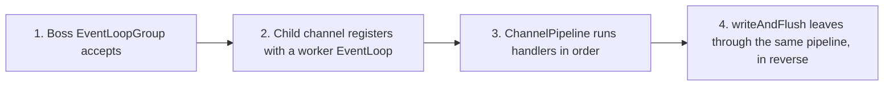
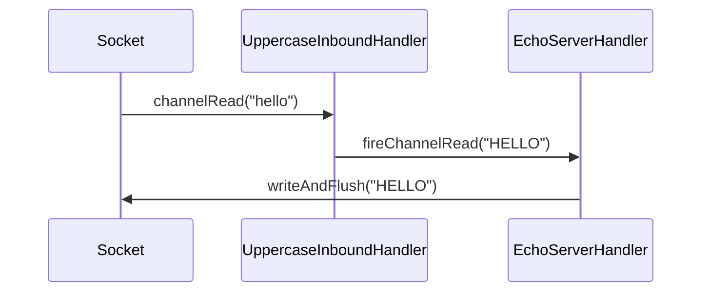

# Netty Event Loop and Channel Pipeline

This lab has one socket, two handlers, and no framing, backpressure, or reconnect logic yet. Its only question is:

> When a client sends bytes, which piece of code touches them, in what order, and on which thread?



## Source code map

The example is not only documentation. Its complete source is under `modules/netty/event-loop-lab`:

| File | What to learn from it |
| --- | --- |
| [`EventLoopLabServer.java`](https://github.com/azusachino/flos/blob/main/modules/netty/event-loop-lab/src/main/java/io/github/azusachino/flos/netty/eventloop/EventLoopLabServer.java) | Wires the boss/worker `EventLoopGroup`s, the `ServerBootstrap`, and the per-connection pipeline |
| [`UppercaseInboundHandler.java`](https://github.com/azusachino/flos/blob/main/modules/netty/event-loop-lab/src/main/java/io/github/azusachino/flos/netty/eventloop/UppercaseInboundHandler.java) | Transforms inbound bytes and forwards them to the next handler |
| [`EchoServerHandler.java`](https://github.com/azusachino/flos/blob/main/modules/netty/event-loop-lab/src/main/java/io/github/azusachino/flos/netty/eventloop/EchoServerHandler.java) | Tracks connection lifecycle and writes the message back out |
| [`EventLoopPipelineTest.java`](https://github.com/azusachino/flos/blob/main/modules/netty/event-loop-lab/src/test/java/io/github/azusachino/flos/netty/eventloop/EventLoopPipelineTest.java) | Verifies handler ordering with `EmbeddedChannel`, and proves real acceptance with a real socket |

## Two EventLoopGroups, two jobs

```java
private final EventLoopGroup bossGroup = new NioEventLoopGroup(1);
private final EventLoopGroup workerGroup = new NioEventLoopGroup();
```

An `EventLoopGroup` is a pool of single-threaded event loops. Each `EventLoop` owns its channels for their entire lifetime: the same thread that accepts a connection's first byte handles its last one, so handler code never needs to synchronize against itself.

| Group | Registers | Job |
| --- | --- | --- |
| Boss | The listening `ServerChannel` | Accept incoming TCP connections |
| Worker | Each accepted child `Channel` | Run that connection's pipeline: reads, writes, timers |

The boss group here has exactly one thread because accepting connections is cheap; the worker group defaults to `2 * available processors`, because pipeline work is where the actual I/O and handler logic happens.

## The pipeline is an ordered chain

```java
channel
    .pipeline()
    .addLast(new UppercaseInboundHandler(), new EchoServerHandler(activeConnections));
```

`addLast` appends in call order. An inbound event — a `channelRead`, a `channelActive` — travels head-to-tail through the handlers in that order:



`UppercaseInboundHandler` never touches the socket. It transforms the `ByteBuf` and calls `ctx.fireChannelRead(...)` to hand it to whichever handler is next — it does not know or care that `EchoServerHandler` is next, only that something is. That is what makes the pipeline composable: reordering `addLast` arguments changes behavior without changing either handler's code.

### What if the order were reversed?

Swapping the two `addLast` arguments would echo the original bytes and only then run them through a handler with no outbound effect — the client would receive `hello`, not `HELLO`. Pipeline order is part of the program's behavior, not an implementation detail.

## Connections are observable, not implicit

```java
@Override
public void channelActive(ChannelHandlerContext ctx) {
    activeConnections.incrementAndGet();
    ctx.fireChannelActive();
}
```

`channelActive` and `channelInactive` are lifecycle events, not data events. `EchoServerHandler` uses them to maintain an accurate connection count without touching the socket directly — the same style used later for readiness and health checks once a lab has real state to protect.

## What's proven, what's not

Two different test styles answer two different questions:

| Test | Proves | Does not require |
| --- | --- | --- |
| `pipelineOrderUppercasesBeforeEchoing` (`EmbeddedChannel`) | Handler order and transformation are correct | A real socket, a real thread pool |
| `realSocketRoundTripProvesTheEventLoopAcceptsAndEchoes` (real `Socket`) | The boss/worker `EventLoopGroup`s actually accept a connection and drive that same pipeline | Nothing external — it binds an ephemeral local port |

`EmbeddedChannel` runs handlers synchronously on the calling thread with no real I/O. It is the right tool for proving pipeline semantics deterministically. It cannot prove that `ServerBootstrap` is wired correctly, that the boss group hands connections to the worker group, or that bytes travel over an actual socket — for that, the real-socket test binds port `0` and lets the OS choose a free one, so it is safe to run concurrently and in CI.

## Run the lab

```sh
make netty-event-loop
```

The process listens on port `9000` until stopped with `Ctrl+C`. From a second terminal:

```sh
printf 'hello' | nc localhost 9000
```

Expect back:

```text
HELLO
```

## Exercises

1. Add a third handler that counts bytes read and prints a running total on `channelInactive`. Where in the `addLast` chain does it need to sit to see every message?
2. Change the worker group to a single thread and predict what changes under concurrent connections. Nothing in this lab should actually break — explain why.
3. Remove `ctx.fireChannelActive()` from `EchoServerHandler` and predict which test fails and why.
4. `UppercaseInboundHandler` allocates a new `ByteBuf` per message with `Unpooled.copiedBuffer`. Later labs revisit this once framing introduces buffers that must survive multiple reads.

## What's next

This lab assumes a message always arrives as one clean `ByteBuf`. TCP makes no such promise — the next lab reintroduces framing and shows what happens when it is missing.
