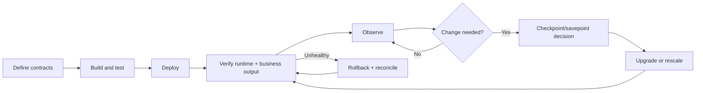

# Flink Operations Handbook

This handbook explains how a team owns a stateful Flink job after the transformation code compiles.

It uses the five-minute user-fee report as a running example:

```text
Kafka order events
  -> event-time validation
  -> keyBy(userId)
  -> five-minute fee aggregation
  -> idempotent report sink
```

The repository currently proves bounded concepts, Java packaging, documentation builds, and a narrow session-cluster smoke. It does **not** prove a production-ready billing job. The production snippets in this handbook are adoption guidance until their storage, security, metrics, failure, and restore paths are implemented and exercised in a real environment.

## Read in this order

1. [Production Readiness](./production-readiness/) defines the contract a job must satisfy before deployment.
2. [Job Lifecycle SOP](./job-lifecycle/) covers build, deploy, verify, operate, upgrade, rollback, and retire.
3. [Observability and Incident Response](./observability-and-incidents/) turns metrics into diagnosis.
4. [Recovery, Upgrade, and Rescaling](./recovery-upgrade-rescaling/) handles state across failures and planned changes.
5. [Real-world Applications](./real-world-applications/) explains where Flink fits and where a simpler system is better.

Keep the [Flink Streaming Glossary](../../concepts/flink/event-time/glossary/) nearby for official terminology with billing and DevOps interpretations.

## Ownership model

Every production job should name:

| Role | Responsibility |
| --- | --- |
| Application owner | Business logic, data contracts, late-data policy, release approval |
| Platform owner | Flink runtime, Kubernetes Operator, storage, networking, security, observability |
| Data owner | Source and sink schemas, retention, reconciliation, downstream expectations |
| Incident commander | Coordinates mitigation, rollback, communication, and evidence preservation |

One person may hold multiple roles in a small team, but the responsibilities should remain explicit.

## Maintenance loop



## Evidence levels

Use precise claims:

| Evidence | What it proves |
| --- | --- |
| Unit test | Function or assigner semantics for selected cases |
| Bounded local job | Packaged topology produces expected finite output |
| Static manifest validation | Configuration parses and matches a schema |
| Session-cluster smoke | Artifact can execute on a real Flink runtime |
| Connector integration test | Source/sink contracts work against real dependencies |
| Failure drill | Checkpoint recovery preserves the tested state and source position |
| Savepoint restore drill | The tested revision is state-compatible |
| Production observation | The deployed environment meets measured traffic and recovery requirements |

Never promote a lower evidence level into a stronger claim.

## Version baseline

This handbook targets:

```text
Flink                  2.2.1
Java                   17
Flink Kubernetes Operator 1.15.0
```

Review the corresponding official documentation before changing either Flink or Operator versions. A runtime upgrade and an operator upgrade are separate procedures.
