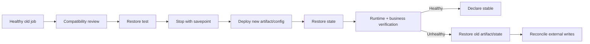

# Flink Recovery, Upgrade, and Rescaling

Stateful maintenance has two independent correctness boundaries:

```text
Flink boundary    operator state + source positions
external boundary source retention + sink writes + downstream effects
```

Restoring Flink state does not erase output already committed to an external system.

## Checkpoint versus savepoint

| Property | Checkpoint | Savepoint |
| --- | --- | --- |
| Primary purpose | Automatic failure recovery | Planned stop, upgrade, migration, fork, or rescale |
| Trigger | Periodic/runtime-managed | Operator/user action |
| Lifecycle | Usually runtime-owned | Usually user-owned |
| Optimization | Fast recurring snapshots and restore | Portability or native speed depending on format |
| Normal SOP use | Recover a failed job | Establish a controlled change boundary |

## Recovery drill

Start with the repository's executable [Checkpoint and Recovery Lab](../../../concepts/flink/state/checkpoint-recovery/). It proves task restart and in-memory checkpoint restoration in an embedded MiniCluster.

Run before production and periodically:

1. Start a job with a durable checkpoint directory.
2. Feed events into at least two open windows.
3. Wait for a completed checkpoint and record its path/time.
4. Terminate one TaskManager.
5. Observe restart and state restoration.
6. Continue the source.
7. Advance watermarks until windows close.
8. Verify totals, counts, source positions, and sink idempotency.
9. Measure recovery time.

Evidence record:

```yaml
recoveryDrill:
    revision: sha256:REPLACE
    checkpoint: s3://example-flink/checkpoints/REPLACE
    stateSize: 2.4GiB
    failure: taskmanager-pod-delete
    recoveryTime: 4m12s
    sourcePositionVerified: true
    reportTotalsVerified: true
    duplicateRows: 0
```

## Savepoint restore test

The executable [Savepoint Upgrade and Rescaling Lab](../../../concepts/flink/state/savepoint-upgrade/) proves this flow locally with a canonical savepoint and a parallelism change from one to two.

Before a stateful release:

```sh
flink stop \
  --savepointPath s3://example-flink/savepoints \
  "$OLD_JOB_ID"

flink run \
  --detached \
  -s s3://example-flink/savepoints/savepoint-REPLACE \
  pipeline-lab.jar
```

Verify:

- every saved operator UID maps to the new job
- state serializers restore
- source resumes at the expected position
- open windows contain expected accumulators
- checkpoints resume under the new revision
- sink output remains correct

## State compatibility review

| Change | Default posture |
| --- | --- |
| Change stateless map/filter logic | Review topology and UID stability |
| Add stateless operator | Usually compatible when stateful UIDs are stable |
| Rename operator display name | Compatible if UID remains stable |
| Change operator UID | Incompatible unless intentionally remapped |
| Change keyed-state type/serializer | Treat as migration |
| Change `keyBy` selector | Treat as new keyed-state layout |
| Change window size/type/offset | Treat as state and business-semantic migration |
| Change allowed lateness | Review state retention and output correction behavior |
| Remove stateful operator | Explicit state disposal decision |
| Use `--allowNonRestoredState` | Explicitly authorize state loss |

## Application upgrade



Prefer one active processing timeline. Shadow deployments require an explicit plan for source ownership and duplicate sink effects.

## Flink framework upgrade

1. Read the compatibility notes for the exact source and target versions.
2. Pin connector and Java compatibility.
3. Verify stable UIDs and state serializers.
4. Take a savepoint using the old Flink version.
5. Restore the job in a disposable target-version environment.
6. Exercise checkpoints, failure recovery, watermarks, and sinks.
7. Stop the old job with a final savepoint.
8. Restore under the new version.
9. Keep the old artifact/config and agreed rollback point.

Changing Flink versions without a state restore test is not a normal rolling binary replacement.

## Kubernetes Operator upgrade

The Operator, its CRDs, and running FlinkDeployments have separate lifecycles.

Before upgrading:

```sh
helm template flink-kubernetes-operator \
  flink-operator-repo/flink-kubernetes-operator \
  --version 1.15.0 \
  --values operator-values.yaml > /tmp/operator-rendered.yaml

kubectl diff -f /tmp/operator-rendered.yaml
kubectl get crd flinkdeployments.flink.apache.org -o yaml > /tmp/flinkdeployment-crd-backup.yaml
kubectl get flinkdeployments --all-namespaces -o yaml > /tmp/flinkdeployments-backup.yaml
```

Then:

1. Review Operator compatibility and CRD changes.
2. Back up rendered configuration and live custom resources.
3. Update the Java client library if used.
4. Replace/update CRDs according to the official release procedure.
5. Upgrade the Helm deployment.
6. Verify the Operator is healthy.
7. Verify existing deployments remain stable before changing job specs.

Do not combine an Operator upgrade, Flink runtime upgrade, job-code upgrade, and state migration into one unobservable change.

## Rescaling

Rescaling changes the distribution of keyed state.

Before changing parallelism:

- record current and maximum parallelism
- confirm the target does not exceed maximum parallelism
- compare Kafka partitions with source parallelism
- measure state per subtask and skew
- estimate restore data movement
- confirm task slots and sink capacity
- take and test a savepoint

Example Operator spec change:

```yaml
spec:
    job:
        parallelism: 32
        upgradeMode: savepoint
```

Verification:

```text
all key groups assigned
subtasks running
source partitions assigned
state restored
checkpoints completing
skew improved
sink not saturated
business totals unchanged
```

Increasing parallelism does not repair a bad key. One high-volume user remains one key and therefore belongs to one keyed subtask unless the business aggregation is redesigned.

## Rollback and external reconciliation

If the new revision emitted output before rollback:

1. Identify the time/source-position range processed by each revision.
2. Identify sink keys or transactions written by the failed revision.
3. Restore the compatible Flink state.
4. Replay or correct external output using the sink's idempotency/version contract.
5. Verify downstream consumers.

For the fee report, a versioned upsert is safer than an append:

```sql
UPDATE bill_fee_report
SET total_fee = ?,
    event_count = ?,
    report_version = ?
WHERE user_id = ?
  AND window_start = ?
  AND report_version < ?;
```

The exact conflict rule belongs to the billing contract and database.

## Official references

- [Savepoints](https://nightlies.apache.org/flink/flink-docs-release-2.2/docs/ops/state/savepoints/)
- [Checkpoints](https://nightlies.apache.org/flink/flink-docs-release-2.2/docs/ops/state/checkpoints/)
- [Upgrading applications and Flink](https://nightlies.apache.org/flink/flink-docs-master/docs/ops/upgrading/)
- [Operator upgrade process](https://nightlies.apache.org/flink/flink-kubernetes-operator-docs-release-1.15/docs/operations/upgrade/)
